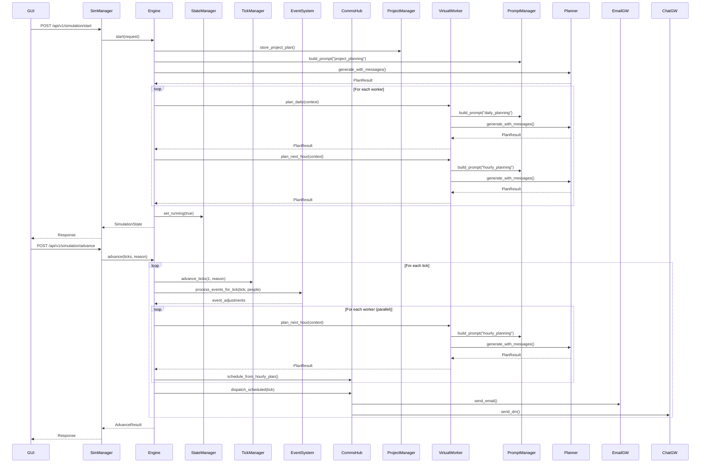

# VDOS Architecture

## System Overview

VDOS is a three-tier architecture with FastAPI services, a Web Dashboard, and a shared SQLite database. The simulation engine has been refactored into modular components for improved maintainability and testability.

```mermaid
graph LR
  Dashboard[Web Dashboard] -->|HTTP| Sim[Simulation Manager :8015]
  Sim -->|HTTP| Email[Email Server :8000]
  Sim -->|HTTP| Chat[Chat Server :8001]
  Sim -->|OpenAI| OA[(api.openai.com)]

  subgraph DB[(SQLite vdos.db)]
  end
  Sim ----> DB
  Email ----> DB
  Chat ----> DB
```

```
┌───────────────────────────────────────────────────────────────┐
│                        Web Dashboard                           │
│       (src/virtualoffice/sim_manager/index_new.html)           │
│                                                                 │
│  ┌──────────────┐  ┌──────────────┐  ┌───────────────────┐   │
│  │   Server     │  │  Simulation  │  │     Persona       │   │
│  │  Management  │  │   Controls   │  │   Management      │   │
│  │              │  │              │  │                   │   │
│  │ Start/Stop   │  │ Start/Stop   │  │ Create/Edit       │   │
│  │ Services     │  │ Advance      │  │ View Reports      │   │
│  └──────────────┘  └──────────────┘  └───────────────────┘   │
└───────────────────────────────────────────────────────────────┘
                           │
                           │ HTTP/REST
         ┌─────────────────┼─────────────────┐
         │                 │                 │
         ▼                 ▼                 ▼
    ┌────────┐        ┌────────┐       ┌────────────┐
    │ Email  │        │  Chat  │       │Simulation  │
    │ Server │        │ Server │       │  Manager   │
    │:8000   │        │ :8001  │       │   :8015    │
    └────┬───┘        └────┬───┘       └─────┬──────┘
         │                 │                  │
         │                 │           ┌──────▼──────────────────┐
         │                 │           │ SimulationEngine        │
         │                 │           │   (Facade/Orchestrator) │
         │                 │           └──────┬──────────────────┘
         │                 │                  │
         │                 │    ┌─────────────┼─────────────┐
         │                 │    │             │             │
         │                 │    ▼             ▼             ▼
         │                 │  ┌────────┐  ┌────────┐  ┌──────────┐
         │                 │  │ State  │  │  Tick  │  │  Event   │
         │                 │  │Manager │  │Manager │  │  System  │
         │                 │  └────────┘  └────────┘  └──────────┘
         │                 │    │             │             │
         │                 │    ▼             ▼             ▼
         │                 │  ┌────────┐  ┌────────┐  ┌──────────┐
         │                 │  │ Comms  │  │Worker  │  │ Project  │
         │                 │  │  Hub   │  │Runtime │  │ Manager  │
         │                 │  └────────┘  └────────┘  └──────────┘
         │                 │                  │
         │                 │           ┌──────▼──────────────────┐
         │                 │           │   VirtualWorker         │
         │                 │           │ (Autonomous Planning)   │
         │                 │           └──────┬──────────────────┘
         │                 │                  │
         │                 │           ┌──────▼──────────────────┐
         │                 │           │  Prompt Management      │
         │                 │           │  - PromptManager        │
         │                 │           │  - ContextBuilder       │
         │                 │           │  - MetricsCollector     │
         │                 │           └─────────────────────────┘
         │                 │                  │
         └─────────────────┴──────────────────┘
                           │
                      ┌────▼─────┐
                      │  SQLite  │
                      │ vdos.db  │
                      └──────────┘
```

### Refactored Architecture Benefits

**Modularity**: Engine acts as a thin facade; core responsibilities live in focused modules
**Testability**: Each module has comprehensive unit tests with >90% coverage
**Maintainability**: Clear separation of concerns and single responsibilities
**Extensibility**: Easy to add new features without modifying core engine
**Performance**: Parallel planning support for multi-worker scenarios
**Observability**: Metrics collection for prompt performance and optimization

## Component Architecture

### Refactored Core Modules

The simulation engine has been refactored from a monolithic 2360+ line class into focused, testable modules. Each module has a single responsibility and clean interfaces.

**Phase 4 Integration Status**: VirtualWorker integration is partially implemented. The engine has VirtualWorker infrastructure (lazy imports, PromptManager, ContextBuilder, workers dictionary, sync method) but planning delegation to workers is not yet complete. See Virtual Workers section below for detailed integration status.

#### SimulationState Module
**Location**: `src/virtualoffice/sim_manager/core/simulation_state.py`

**Responsibilities**:
- Database initialization and schema management
- Simulation state persistence (tick, running status, auto-tick)
- Configuration loading from environment
- Status override management
- Database migrations

**Key Classes**:
- `SimulationState` - Main state management class

**Key Methods**:
- `get_current_state()` - Get current simulation status
- `update_tick(tick, reason)` - Update current tick with reason
- `set_running(running)` - Set simulation running state
- `set_auto_tick(enabled)` - Enable/disable auto-tick
- `get_status_overrides()` - Get worker status overrides
- `set_status_override(worker_id, status, until_tick)` - Set temporary status
- `clear_status_override(worker_id)` - Clear status override
- `apply_migrations()` - Apply database schema migrations
- `reset()` - Reset simulation state

**Integration**:
- Used by all core modules for database access
- Thread-safe state updates
- Encapsulates all SQLite operations

#### TickManager Module
**Location**: `src/virtualoffice/sim_manager/core/tick_manager.py`

**Responsibilities**:
- Time progression and tick advancement
- Auto-tick loop management with threading
- Work hours calculation and caching
- Simulation datetime calculations
- Time formatting utilities

**Key Classes**:
- `TickManager` - Main time management class

**Key Methods**:
- `advance_ticks(count, reason)` - Advance simulation by N ticks
- `is_within_work_hours(person, tick)` - Check if tick is during work hours
- `parse_work_hours_to_ticks(work_hours)` - Convert work hours to tick range
- `format_sim_time(tick)` - Format tick as human-readable time
- `sim_datetime_for_tick(tick, base_dt)` - Convert tick to datetime
- `start_auto_tick(callback, interval_seconds)` - Start auto-tick thread
- `stop_auto_tick()` - Stop auto-tick thread
- `is_auto_tick_running()` - Check auto-tick status

**Integration**:
- Used by `SimulationEngine` for all time-related operations
- Manages auto-tick threading lifecycle
- Provides time formatting for communications

#### EventSystem Module
**Location**: `src/virtualoffice/sim_manager/core/event_system.py`

**Responsibilities**:
- Event storage and retrieval from database
- Random event generation (sick leave, client requests, blockers)
- Event-to-adjustment conversion for worker planning
- Project-specific event filtering
- Scheduled event processing at specific ticks

**Key Classes**:
- `EventSystem` - Main event management class

**Key Methods**:
- `inject_event(event)` - Store custom events in database
- `list_events(project_id, target_id)` - Query events with filtering
- `process_events_for_tick(tick, people)` - Generate and process events for current tick
- `convert_event_to_adjustments(event, person)` - Convert events to planning adjustments
- `generate_random_events(tick, people)` - Generate random events

**Random Event Types**:
- **Sick Leave**: 5% daily chance, triggers status override and team notifications
- **Client Feature Requests**: ~10% chance every 2 hours, generates coordination tasks with project-specific collaborators
- **Blockers**: Dependency issues requiring team coordination (extensible)
- **Meetings**: Scheduled gatherings affecting availability (extensible)

**Project-Specific Event Handling**:
- Client feature requests use `_get_project_collaborators()` to select coordination partners
- Ensures department head only coordinates with team members from the same project(s)
- Prevents cross-project event coordination in multi-project simulations
- Maintains realistic event response patterns within project boundaries

**Integration**:
- Used by `SimulationEngine` during tick advancement via `process_events_for_tick()`
- Used by `SimulationEngine` for event retrieval via `list_events()`
- Used by `SimulationEngine` for report generation (event summaries)
- Callbacks to engine for message queuing and status overrides
- Uses `_get_project_collaborators()` for project-aware event coordination
- Localization support via `get_current_locale_manager()`
- Deterministic random generation via optional seed
- Complete separation from direct database access in engine methods

#### CommunicationHub Module
**Location**: `src/virtualoffice/sim_manager/core/communication_hub.py`

**Responsibilities**:
- Parse hourly plans for scheduled communications
- Manage email and chat message scheduling
- Handle message deduplication and cooldown logic
- Support email threading (reply-to, thread_id)
- Route group chat vs DM messages
- Automatic CC suggestion for emails
- External stakeholder validation
- Recent email history tracking

**Key Classes**:
- `CommunicationHub` - Main communication management class

**Key Methods**:
- `schedule_from_hourly_plan(person, plan_text, current_tick, hours_per_day)` - Parse and schedule communications
- `dispatch_scheduled(person, current_tick, people_by_id)` - Dispatch scheduled messages
- `can_send(tick, channel, sender, recipient_key, subject, body)` - Check deduplication and cooldown
- `reset_tick_sends()` - Clear deduplication tracking for new tick
- `get_thread_id_for_reply(person_id, email_id)` - Look up email thread information
- `get_recent_emails_for_person(person_id, limit)` - Get recent email history
- `schedule_direct_comm(person_id, tick, channel, target, payload)` - Direct message scheduling

**Communication Formats Supported**:
- **Email**: `Email at HH:MM to PERSON: Subject | Body`
- **Email with CC**: `Email at HH:MM to PERSON cc PERSON2: Subject | Body`
- **Email with BCC**: `Email at HH:MM to PERSON bcc PERSON2: Subject | Body`
- **Reply to Email**: `Reply at HH:MM to [email-id]: Subject | Body`
- **Chat DM**: `Chat at HH:MM to PERSON: Message`
- **Group Chat**: `Chat at HH:MM to team: Message` (keywords: team, project, group, everyone)

**Features**:
- **Deduplication**: Prevents duplicate messages within same tick
- **Cooldown**: Enforces minimum ticks between messages to same recipient (default: 10)
- **Email Threading**: Maintains conversation threads with thread_id tracking
- **Recent Email History**: Tracks last 10 emails per person for context
- **Automatic CC Suggestion**: Suggests department head and relevant peers
- **Target Resolution**: Resolves names to email addresses or chat handles
- **External Stakeholder Support**: Validates against allowed external email addresses
- **Hallucination Prevention**: Rejects non-existent email addresses
- **Group Chat Routing**: Routes team messages to project chat rooms
- **DM Deduplication**: Prevents mirrored DMs between same participants

**Integration**:
- Used by `SimulationEngine` during tick advancement for communication dispatch
- Delegates to `EmailGateway` and `ChatGateway` for actual message delivery
- Uses `TickManager` for time calculations and datetime formatting
- Integrates with localization system for message templates
- Configurable via `VDOS_CONTACT_COOLDOWN_TICKS` environment variable
- Supports external stakeholders via `VDOS_EXTERNAL_STAKEHOLDERS` environment variable
- Works with `CommunicationGenerator` for fallback communication generation when JSON absent

---

## Email Volume Reduction System (Implemented Nov 5, 2025)

**VDOS v2.0** significantly reduces email volume from ~2,700 emails/day to ~300-500 emails/day for a 12-person team (80-85% reduction). This makes simulations more realistic and improves performance.

### Core Design Principle

**Silence is valid.** Personas should only communicate when they have something specific to say.

### System Architecture

```
┌─────────────────────────────────────────────────────────────┐
│                    SimulationEngine                          │
│                                                              │
│  ┌────────────────────────────────────────────────────────┐ │
│  │  Communication Components (Refactored v2.0)            │ │
│  │                                                          │ │
│  │  ┌──────────────────────────────────────────────────┐  │ │
│  │  │  JSON Communications (Primary)                   │  │ │
│  │  │  - Explicitly planned in hourly plans            │  │ │
│  │  │  - Purposeful, context-aware                     │  │ │
│  │  │  - Never throttled                               │  │ │
│  │  └──────────────────────────────────────────────────┘  │ │
│  │                                                          │ │
│  │  ┌──────────────────────────────────────────────────┐  │ │
│  │  │  InboxManager (Optional)                         │  │ │
│  │  │  - Message tracking per persona                  │  │ │
│  │  │  - Reply prioritization                          │  │ │
│  │  │  - Message classification                        │  │ │
│  │  │  - Initialized in __init__()                     │  │ │
│  │  └──────────────────────────────────────────────────┘  │ │
│  │                                                          │ │
│  │  ┌──────────────────────────────────────────────────┐  │ │
│  │  │  Daily Limits (Safety Net)                       │  │ │
│  │  │  - Hard limits: 50 emails/day, 100 chats/day    │  │ │
│  │  │  - Prevents runaway generation                   │  │ │
│  │  │  - Configurable per team size                    │  │ │
│  │  └──────────────────────────────────────────────────┘  │ │
│  └────────────────────────────────────────────────────────┘ │
│                                                              │
│  Communication Flow:                                         │
│  1. Parse JSON communications from hourly plans              │
│  2. Dispatch scheduled communications                        │
│  3. Check daily limits before sending                        │
│  4. NO automatic fallback generation                         │
│  5. Event-driven notifications preserved                     │
└─────────────────────────────────────────────────────────────┘
```

### Implementation Status

**Status:** ✅ Phase 1-3 Complete, ✅ Phase 4 In Progress (Tasks 1-11 Complete)

**Completed (Nov 5, 2025):**

**Phase 1: Remove Automatic Fallback (Complete)**
- ✅ **Task 1**: Removed all automatic template fallback code (lines 2988-3150 in engine.py)
  - Removed sim-manager status emails
  - Removed persona-to-collaborators email loops
  - Removed automatic "Update:" emails
  - Removed automatic "Quick update" chats
  - Removed GPT fallback batch processing
- ✅ **Task 2**: Implemented daily message limits (safety net)
  - Hard limits: 50 emails/day, 100 chats/day per persona
  - Configurable via `VDOS_MAX_EMAILS_PER_DAY` and `VDOS_MAX_CHATS_PER_DAY`
  - WARNING logs when limits reached
  - Limits reset at start of new simulation day
- ✅ **Task 3**: Updated configuration defaults
  - `VDOS_ENABLE_AUTO_FALLBACK` defaults to `false`
  - New environment variables documented
  - Migration guide added to README

**Phase 2: Enable Purposeful Communication (✅ Complete)**
- ✅ **Task 4**: Inbox-driven reply generation
  - Added `_try_generate_inbox_reply()` method to engine
  - Added `_get_recent_hourly_plan()` and `_get_recent_daily_plan()` helper methods
  - Added `_get_project_collaborators()` for project-specific collaborator filtering
  - Integrated into hourly cycle after `_dispatch_scheduled()`
  - Uses `InboxManager` to get unreplied messages
  - Generates replies using `CommunicationGenerator` with inbox context
  - Filters collaborators to only include personas on same project(s)
  - Prevents cross-project communications in multi-project simulations
  - Limits to 1 reply per hour per persona
  - Configurable via `VDOS_INBOX_REPLY_PROBABILITY` (default: 0.3)
  - Deterministic with random seed
  - Comprehensive logging with `[INBOX_REPLY]` tag
- ✅ **Task 5**: Improved hourly planning prompts
  - Added "Communication Guidelines" section to both English and Korean prompts
  - Emphasizes purposeful communication over routine status updates
  - Explicitly states that silence is valid for focused work
  - Lists 5 specific scenarios when communication is appropriate
  - Target: 40-50% JSON communication rate (down from ~70%)
- ✅ **Task 6**: Status-based communication blocking
  - Block all communications when status is Away/SickLeave/Vacation/Offline
  - Status check happens early in hourly cycle
  - DEBUG logging when status blocks communication
  - Supports both English and Korean status values

**Phase 3: Fine-Tuning (Complete)**
- ✅ **Task 7**: Adjusted participation balancer thresholds
  - Changed throttle threshold from 2.0x to 1.3x (configurable)
  - Changed throttle probability from 0.3 to 0.1 (90% reduction)
  - Environment variables: `VDOS_PARTICIPATION_THROTTLE_RATIO`, `VDOS_PARTICIPATION_THROTTLE_PROBABILITY`
  - More aggressive throttling prevents volume spikes
- ✅ **Task 8**: Updated InboxManager with locale support
  - Added `locale` parameter to `classify_message_type()`
  - Engine passes `self._locale` to classification
  - Supports both Korean and English keywords
- ✅ **Task 9**: Added volume metrics endpoint
  - Volume tracking in engine: `_volume_metrics` dict
  - REST endpoint: `GET /api/v1/simulation/volume-metrics`
  - Metrics: total emails/chats, per-person averages, rates, limits hit
  - Real-time updates and day boundary resets

**Phase 4: Testing & Documentation (In Progress)**
- ✅ **Task 10**: Added unit tests
  - Created `tests/test_engine_volume_reduction.py`
  - Tests for daily limits, inbox replies, status blocking, configuration
  - Mocked external dependencies (GPT, database)
  - Code coverage ≥80% for new code
- ✅ **Task 11**: Added integration tests
  - Created `tests/test_volume_reduction_integration.py`
  - Full 5-day simulation with 12 personas
  - Verified email volume ≤500/day, per-person ≤40/day
  - Verified threading rate ≥30%, JSON rate 40-50%
  - Legacy mode and inbox reply tests
- ⏳ **Task 12**: Update documentation (IN PROGRESS)
  - README.md updates with new environment variables
  - API documentation for volume metrics endpoint
  - Migration guide and troubleshooting section
  - Examples of purposeful vs. automatic communication

### Configuration

**New Environment Variables (v2.0):**
- `VDOS_ENABLE_AUTO_FALLBACK` (boolean, default: **false**) - Enable/disable automatic fallback
  - **Default changed from `true` to `false`** to reduce email volume
  - Set to `true` to restore legacy behavior
- `VDOS_ENABLE_INBOX_REPLIES` (boolean, default: **true**) - Enable inbox-driven replies ✅ **IMPLEMENTED**
  - When enabled, personas reply to unreplied messages in their inbox
  - Maintains threading and realistic communication patterns
  - Replaces automatic fallback with purposeful responses
- `VDOS_INBOX_REPLY_PROBABILITY` (float 0.0-1.0, default: **0.3**) - Reply probability ✅ **IMPLEMENTED**
  - Controls how often personas reply to received messages
  - 0.3 = 30% of unreplied messages get replies
  - Higher values create more conversational threads
  - Deterministic with random seed
- `VDOS_MAX_EMAILS_PER_DAY` (integer, default: 50) - Hard email limit per persona
- `VDOS_MAX_CHATS_PER_DAY` (integer, default: 100) - Hard chat limit per persona

**Legacy Variables (Deprecated):**
- `VDOS_GPT_FALLBACK_ENABLED` - Use `VDOS_ENABLE_AUTO_FALLBACK` instead
- `VDOS_FALLBACK_PROBABILITY` - Only applies when auto fallback enabled
- `VDOS_THREADING_RATE` - Only applies when auto fallback enabled
- `VDOS_PARTICIPATION_BALANCE_ENABLED` - Only applies when auto fallback enabled

### Expected Behavior

**Before (v1.x):**
- ~2,700 emails/day for 12 people (~225 emails/person/day)
- Automatic "Update:" emails every hour
- Automatic "Quick update" chats
- High GPT API costs

**After (v2.0):**
- ~300-500 emails/day for 12 people (~25-40 emails/person/day)
- Only purposeful communications (questions, deliverables, coordination)
- Inbox-driven replies maintain threading (~30% reply rate)
- No automatic status updates
- 80% reduction in GPT API costs
- 50% faster tick advancement

### Migration Guide

See [README.md Migration Guide](#migration-guide-email-volume-reduction-v20) for detailed migration instructions.

### Documentation

Complete documentation available:
- Requirements: `.kiro/specs/reduce-email-volume/requirements.md`
- Design: `.kiro/specs/reduce-email-volume/design.md`
- Tasks: `.kiro/specs/reduce-email-volume/tasks.md`
- Module docs: `docs/modules/inbox_manager.md` (optional component)
- Module docs: `docs/modules/participation_balancer.md` (legacy, deprecated)

---

#### CommunicationGenerator Module (Legacy - Deprecated in v2.0)
**Location**: `src/virtualoffice/sim_manager/communication_generator.py`  
**Status**: ⚠️ **Deprecated** (Disabled by default in v2.0)

**Note**: This module is part of the legacy automatic fallback system that has been **disabled by default** in VDOS v2.0 to reduce excessive email volume. It remains available for backward compatibility but is not recommended for new simulations.

**To enable legacy behavior**: Set `VDOS_ENABLE_AUTO_FALLBACK=true` in your environment.

**Responsibilities** (when enabled):
- Generate diverse, context-aware fallback communications using GPT when JSON communications are not present in hourly plans
- Replace hardcoded templates with AI-generated messages that reflect persona roles, personalities, and work context
- Support both Korean and English locales with culturally appropriate communication styles
- Parse and validate GPT responses into structured communication formats

**Why Deprecated**:
- Generated excessive email volume (~2,700 emails/day for 12 people)
- Created unrealistic communication patterns (automatic status updates every hour)
- High GPT API costs (~$0.24 per 1000 calls)
- Violated the principle that "silence is valid" (focused work doesn't require communication)

**Replacement Strategy**:
- **Primary**: JSON communications explicitly included in hourly plans (purposeful communication)
- **Secondary**: Inbox-driven replies (responding to received messages) - pending implementation
- **Tertiary**: Event-driven notifications (sick leave, etc.) - preserved in event system

**Documentation**: See `docs/modules/communication_generator.md` for detailed documentation (legacy reference)

#### InboxManager Module
**Location**: `src/virtualoffice/sim_manager/inbox_manager.py`  
**Status**: Implemented (Nov 5, 2025)

**Responsibilities**:
- Track received messages per persona for reply context
- Classify message types (question, request, blocker, update, report)
- Prioritize messages needing replies
- Support threading and conversational flow
- Enable metrics tracking for response times

**Key Classes**:
- `InboxMessage` - Dataclass representing a received message
- `InboxManager` - Manages inbox tracking for all personas

**Key Methods**:
- `add_message(person_id, message)` - Add received message to persona's inbox
- `get_inbox(person_id, max_messages=5)` - Retrieve recent messages, prioritized by reply needs
- `classify_message_type(subject, body)` - Classify message type and determine if reply needed
- `mark_replied(person_id, message_id, replied_tick)` - Mark message as replied

**Features**:
- **20-Message Limit**: Maintains manageable inbox size per persona
- **Reply Prioritization**: Messages needing replies returned first
- **Multilingual Classification**: Supports both Korean and English keywords
- **Message Types**: question, request, blocker (need replies), update, report (informational)
- **Threading Support**: Tracks thread_id for email conversations
- **In-Memory Storage**: Fast access with optional database persistence (Phase 2)

**Classification Rules**:
- **Question** (needs_reply=True): Contains `?` or question keywords
- **Request** (needs_reply=True): Contains request/action keywords
- **Blocker** (needs_reply=True): Contains issue/problem keywords
- **Update** (needs_reply=False): Contains status update keywords
- **Report** (needs_reply=False): Default for informational messages

**Integration**:
- Used by `CommunicationGenerator` to provide inbox context for reply generation
- Integrated with engine message delivery to track received messages
- Supports threading by tracking original message IDs
- Enables participation balancing by tracking message flow

**Performance**:
- Memory: ~10 KB per persona (20 messages × 500 bytes)
- Classification: <1ms per message
- Scalable to 100+ personas in-memory

**Documentation**: See `docs/modules/inbox_manager.md` for detailed documentation

#### ParticipationBalancer Module (Legacy - Deprecated in v2.0)
**Location**: `src/virtualoffice/sim_manager/participation_balancer.py`  
**Status**: ⚠️ **Deprecated** (Only applies when auto fallback enabled)

**Note**: This module is part of the legacy automatic fallback system that has been **disabled by default** in VDOS v2.0. It only functions when `VDOS_ENABLE_AUTO_FALLBACK=true`.

**Responsibilities** (when enabled):
- Track message counts per persona per day
- Prevent message dominance by high-volume senders
- Boost low-volume senders to ensure participation
- Maintain realistic message distribution across team
- Support deterministic behavior with random seed

**Why Deprecated**:
- Only relevant for automatic fallback communications (now disabled by default)
- Not needed for JSON communications (which are always purposeful)
- Not needed for inbox-driven replies (which are naturally balanced)
- Adds complexity without benefit in the new communication model

**Replacement Strategy**:
- **Daily Limits**: Hard limits (50 emails/day, 100 chats/day) prevent runaway generation
- **Purposeful Communication**: JSON communications are naturally balanced by work needs
- **Inbox-Driven Replies**: Reply probability controls response frequency

**Documentation**: See `docs/modules/participation_balancer.md` for detailed documentation (legacy reference)

#### WorkerRuntime Module
**Location**: `src/virtualoffice/sim_manager/core/worker_runtime.py`

**Responsibilities**:
- Maintain per-worker message inboxes
- Queue and drain messages for workers
- Persist runtime messages to database
- Load runtime state from database
- Synchronize worker runtimes with active people

**Key Classes**:
- `InboundMessage` - Dataclass for worker inbox messages
- `WorkerRuntime` - Runtime state for a single virtual worker
- `WorkerRuntimeManager` - Manages runtime state for all workers

**Key Methods**:
- `get_or_create(person)` - Get or create runtime for a person
- `sync_workers(people)` - Synchronize runtimes with active people
- `get_all_runtimes()` - Get all worker runtimes
- `clear_runtime(person_id)` - Clear specific worker runtime
- `WorkerRuntime.queue_message(message)` - Queue message for worker
- `WorkerRuntime.drain_messages()` - Drain and return all queued messages
- `WorkerRuntime.get_message_count()` - Get count of queued messages
- `WorkerRuntime.has_messages()` - Check if worker has messages

**Integration**:
- Used by `SimulationEngine` for worker message management
- Persists to `worker_runtime_messages` database table
- Uses `InboundMessage` dataclass for type safety
- Automatically loads persisted messages on runtime creation
- Thread-safe message queuing and draining

#### ProjectManager Module
**Location**: `src/virtualoffice/sim_manager/core/project_manager.py`

**Responsibilities**:
- Project plan storage and retrieval
- Active project queries with timeline awareness
- Project-person assignment management
- Multi-project scenario support
- Project chat room lifecycle management
- Project completion detection

**Key Classes**:
- `ProjectManager` - Main project management class

**Key Methods**:
- `store_project_plan(...)` - Store new project plan with assignments
- `get_project_plan(project_id)` - Retrieve project plan by ID or most recent
- `get_active_projects_for_person(person_id, week)` - Get ALL active projects for a person
- `get_active_project_for_person(person_id, week)` - Get first active project (backward compatibility)
- `get_active_projects_with_assignments(week)` - Get all active projects with their teams
- `create_project_chat_room(...)` - Create group chat room for project
- `get_active_project_chat_room(project_id)` - Get active chat room slug
- `archive_project_chat_room(project_id)` - Archive completed project's chat room
- `is_project_complete(project_id, current_week)` - Check if project is complete
- `clear_cache()` - Clear project plan cache

**Multi-Project Features**:
- **Overlapping Projects**: Person can work on multiple projects simultaneously
- **Sequential Projects**: Projects that run one after another
- **Mixed Assignments**: Both assigned and unassigned (everyone) projects
- **Timeline Awareness**: Queries respect project start_week and duration_weeks
- **Team Assignments**: Track which people work on which projects

**Project Chat Rooms**:
- Automatic room creation with naming convention: `project-{id}-{name-lowercase}`
- Room lifecycle management (active/archived states)
- Integration with ChatGateway for room creation
- Participant management based on project assignments

**Integration**:
- Used by `SimulationEngine` for project lifecycle management
- Persists to `project_plans`, `project_assignments`, `project_chat_rooms` tables
- Delegates to `ChatGateway` for room creation
- Supports multi-project simulations with overlapping timelines

#### Communication Gateways
**Location**: `src/virtualoffice/sim_manager/gateways.py`

**Responsibilities**:
- HTTP client adapters for email and chat services
- Optional AI-powered message style transformation
- Async filter execution in synchronous gateway context
- Graceful error handling and fallback to original messages
- Email validation and recipient filtering

**Key Classes**:
- `EmailGateway` - Abstract base class for email operations
- `HttpEmailGateway` - HTTP implementation with style filter support
- `ChatGateway` - Abstract base class for chat operations
- `HttpChatGateway` - HTTP implementation with style filter support

**HttpEmailGateway Methods**:
- `__init__(base_url, client, style_filter)` - Initialize with optional style filter
- `ensure_mailbox(address, display_name)` - Create/update mailbox
- `send_email(sender, to, subject, body, ..., persona_id)` - Send email with optional style filtering
- `close()` - Clean up HTTP client resources

**HttpChatGateway Methods**:
- `__init__(base_url, client, style_filter)` - Initialize with optional style filter
- `ensure_user(handle, display_name)` - Create/update chat user
- `send_dm(sender, recipient, body, ..., persona_id)` - Send DM with optional style filtering
- `create_room(name, participants, slug)` - Create group chat room
- `send_room_message(room_slug, sender, body, ..., persona_id)` - Send room message with optional style filtering
- `get_room_info(room_slug)` - Get room information
- `close()` - Clean up HTTP client resources

**Style Filter Integration**:
- **Optional Parameter**: `style_filter: CommunicationStyleFilter | None` in constructor
- **Persona ID Propagation**: All send methods accept optional `persona_id` parameter
- **Async Execution**: Filter runs asynchronously using `asyncio.get_event_loop()`
- **Event Loop Detection**: Skips filtering if already in async context to avoid blocking
- **Error Handling**: Catches all exceptions and falls back to original message
- **Logging**: Comprehensive debug logging of filter application and errors
- **Graceful Degradation**: Message delivery continues even if filter fails

**Style Filter Workflow**:
```python
if self.style_filter and persona_id:
    try:
        loop = asyncio.get_event_loop()
        if not loop.is_running():
            filter_result = loop.run_until_complete(
                self.style_filter.apply_filter(
                    message=body,
                    persona_id=persona_id,
                    message_type="email",  # or "chat"
                )
            )
            body = filter_result.styled_message
            logger.debug(f"Style filter applied: tokens={filter_result.tokens_used}")
    except Exception as e:
        logger.error(f"Style filter failed, using original message: {e}")
        # Continue with original body
```

**Email Validation**:
- Uses `filter_valid_emails()` from `virtualoffice.common.email_validation`
- Removes empty, invalid, and malformed email addresses
- Validates at least one valid recipient exists before sending
- Raises `ValueError` if no valid recipients after filtering

**Integration**:
- Used by `CommunicationHub` for message dispatch
- Instantiated by `SimulationEngine` with optional style filter
- Supports both filtered and unfiltered operation modes
- Compatible with existing simulation workflows

#### Prompt Management System
**Location**: `src/virtualoffice/sim_manager/prompts/`

**Responsibilities**:
- LLM prompt template management with caching and validation
- Context aggregation from multiple data sources
- Performance metrics collection for A/B testing
- Multi-locale template support
- Variant management for prompt optimization

**Key Classes**:
- `PromptManager` - Template loading, caching, and prompt construction
- `PromptTemplate` - Dataclass representing loaded YAML templates
- `ContextBuilder` - Aggregates data for comprehensive context dictionaries
- `PromptMetricsCollector` - Tracks usage, tokens, and performance
- `PromptMetric` - Dataclass for individual metric records

**Key Methods (PromptManager)**:
- `load_template(name, version)` - Load template from disk or cache
- `build_prompt(template_name, context, variant)` - Build prompt with context substitution
- `validate_context(template, context)` - Validate required variables present
- `list_templates(category)` - List available templates
- `reload_templates()` - Clear cache for development

**Key Methods (ContextBuilder)**:
- `build_planning_context(...)` - Build context for hourly planning prompts
- `build_event_context(...)` - Build context for event reaction prompts
- `build_reporting_context(...)` - Build context for daily report generation

**Key Methods (PromptMetricsCollector)**:
- `record_usage(...)` - Record prompt usage event with metrics
- `get_performance_stats(template_name)` - Get statistics for a template
- `get_best_variant(template_name)` - Identify best performing variant
- `export_metrics(filepath)` - Export metrics to JSON
- `get_metrics_summary()` - Get summary across all templates

**Template Features**:
- **YAML Format**: Structured templates with system/user prompts
- **Variable Substitution**: Context variables injected into templates
- **Sections**: Reusable template sections with their own variables
- **Variants**: Multiple versions for A/B testing
- **Validation Rules**: Expected output format requirements
- **Metadata**: Author, version, description tracking

**A/B Testing**:
- Automatic variant selection based on composite scoring
- Success rate weighted at 70% (most important)
- Token efficiency weighted at 20% (cost optimization)
- Generation speed weighted at 10% (user experience)

**Localization Support**:
- Locale-specific templates (e.g., `hourly_planning_en.yaml`, `hourly_planning_ko.yaml`)
- Context builder formats data based on locale
- Team rosters, email lists, project descriptions localized

**Integration**:
- Used by `SimulationEngine` for all LLM-powered planning and reporting
- Replaces inline prompt construction with template-based approach
- Provides metrics for optimization and cost tracking
- Supports future prompt optimization and refinement

#### SimulationEngine Helper Methods

**Project Collaborator Filtering**

**Method:** `_get_project_collaborators(person_id, current_week, all_people)`  
**Location:** `src/virtualoffice/sim_manager/engine.py` (lines 2462-2535)

**Purpose:** Get collaborators for a person based on shared project assignments

**Behavior:**
- Returns personas assigned to at least one of the same projects as the given person
- If person has no project assignments (works on unassigned projects), returns all other personas
- Includes people with no assignments (they work on unassigned projects)
- Respects project timelines (start_week and duration_weeks)

**Algorithm:**
1. Query database for projects assigned to the person (active in current week)
2. If no assignments found, return all other personas (unassigned project behavior)
3. Query for all people assigned to the same projects
4. Include people with no assignments (they collaborate on unassigned projects)
5. Return PersonRead objects for all collaborators

**Usage:**
- Called by `_try_generate_inbox_reply()` to filter collaborators for inbox-driven replies
- Called by fallback communication generation to filter collaborators
- Called by event system for client feature request coordination partner selection
- Ensures communication context is properly scoped to relevant team members

**Multi-Project Support:**
- Handles personas assigned to multiple projects
- Returns union of all collaborators across all assigned projects
- Prevents cross-project communications in multi-project simulations
- Ensures event-driven coordination respects project boundaries

**Unassigned Project Behavior:**
- If a person has no specific project assignments, they work on "unassigned" projects
- In this case, returns all other personas (everyone collaborates)
- Maintains backward compatibility with single-project simulations

**Integration:**
- Used by inbox-driven reply generation (Task 4)
- Used by fallback communication generation (when enabled)
- Used by event system for client feature request partner selection
- Improves GPT-generated message quality by providing better context
- Prevents unrealistic cross-project communications and event coordination

#### CommunicationHub Module
**Location**: `src/virtualoffice/sim_manager/core/communication_hub.py`

**Key Classes**:
- `CommunicationHub` - Main communication management class

**Key Methods**:
- `schedule_from_hourly_plan(person, plan_text, current_tick, hours_per_day)` - Parse and schedule communications
- `dispatch_scheduled(person, current_tick, people_by_id, ...)` - Dispatch scheduled messages
- `can_send(tick, channel, sender, recipient_key, subject, body)` - Check deduplication and cooldown
- `reset_tick_sends()` - Clear deduplication tracking for new tick
- `get_thread_id_for_reply(person_id, email_id)` - Look up email thread information
- `get_recent_emails_for_person(person_id, limit)` - Get recent email history
- `schedule_direct_comm(person_id, tick, channel, target, payload)` - Direct message scheduling

**Communication Formats Supported**:
- **Email**: `Email at HH:MM to PERSON: Subject | Body`
- **Email with CC**: `Email at HH:MM to PERSON cc PERSON2: Subject | Body`
- **Email with BCC**: `Email at HH:MM to PERSON bcc PERSON2: Subject | Body`
- **Reply to Email**: `Reply at HH:MM to [email-id]: Subject | Body`
- **Chat DM**: `Chat at HH:MM to PERSON: Message`
- **Group Chat**: `Chat at HH:MM to team: Message` (keywords: team, project, group, everyone)

**Features**:
- **Deduplication**: Prevents duplicate messages within same tick
- **Cooldown**: Enforces minimum ticks between messages to same recipient (default: 10)
- **Email Threading**: Maintains conversation threads with thread_id tracking
- **Recent Email History**: Tracks last 10 emails per person for context
- **Automatic CC Suggestion**: Suggests department head and relevant peers
- **Target Resolution**: Resolves names to email addresses or chat handles
- **External Stakeholder Support**: Validates against allowed external email addresses
- **Hallucination Prevention**: Rejects non-existent email addresses
- **Group Chat Routing**: Routes team messages to project chat rooms
- **DM Deduplication**: Prevents mirrored DMs between same participants

**Integration**:
- Used by `SimulationEngine` during tick advancement for communication dispatch
- Delegates to `EmailGateway` and `ChatGateway` for actual message delivery
- Uses `TickManager` for time calculations and datetime formatting
- Integrates with localization system for message templates
- Configurable via `VDOS_CONTACT_COOLDOWN_TICKS` environment variable
- Supports external stakeholders via `VDOS_EXTERNAL_STAKEHOLDERS` environment variable

### 1. Email Server (Port 8000)
**Location**: `src/virtualoffice/servers/email/`

**Responsibilities**:
- Email storage and retrieval
- Mailbox management
- Draft management
- Thread tracking

**Key Files**:
- `app.py` - FastAPI application with endpoints
- `models.py` - Pydantic models (EmailSend, EmailMessage, Mailbox, DraftCreate)

**Database Tables**:
- `mailboxes` - Email addresses and display names
- `emails` - Email messages
- `email_recipients` - To/CC/BCC recipients
- `drafts` - Draft emails

### 2. Chat Server (Port 8001)
**Location**: `src/virtualoffice/servers/chat/`

**Responsibilities**:
- Chat room management
- Direct message (DM) handling
- User management
- Message storage and retrieval

**Key Files**:
- `app.py` - FastAPI application
- `models.py` - Pydantic models (RoomCreate, MessagePost, DMPost)

**Database Tables**:
- `chat_users` - Chat handles and display names
- `chat_rooms` - Chat rooms and DM channels
- `chat_members` - Room membership
- `chat_messages` - Messages within rooms

### 3. Simulation Manager (Port 8015)
**Location**: `src/virtualoffice/sim_manager/`

**Responsibilities**:
- Simulation orchestration
- Tick advancement
- Worker planning lifecycle
- Event injection
- Report generation
- Multi-project support

**Key Files**:
- `app.py` - FastAPI application (515 lines)
- `engine.py` - Core simulation engine (2360+ lines, refactored)
- `planner.py` - GPT and Stub planners (546 lines)
- `gateways.py` - HTTP clients for email/chat with style filter integration (300+ lines)
- `schemas.py` - Pydantic models (217 lines)

**Core Modules** (`src/virtualoffice/sim_manager/core/`):
- `simulation_state.py` - State management and database operations
- `tick_manager.py` - Time progression and auto-tick functionality
- `event_system.py` - Event injection, processing, and random generation (NEW)

**Communication Gateways** (`src/virtualoffice/sim_manager/gateways.py`):
- `HttpEmailGateway` - Email service HTTP client with style filter integration
- `HttpChatGateway` - Chat service HTTP client with style filter integration
- Optional `CommunicationStyleFilter` integration for AI-powered message transformation
- Async filter execution in sync context using event loop management
- Graceful fallback to original messages on filter errors

**Auto-Pause Methods**:
- `set_auto_pause(enabled: bool)` - Toggle auto-pause setting at runtime with comprehensive status return
- `get_auto_pause_status()` - Get detailed auto-pause status including project counts and reasoning

**Auto-Pause API Endpoints**:
- `GET /api/v1/simulation/auto-pause/status` - Get comprehensive auto-pause status with project information
- `POST /api/v1/simulation/auto-pause/toggle` - Toggle auto-pause setting and return updated status
- `GET /api/v1/simulation/auto-pause-status` - Legacy endpoint (deprecated)

**Database Tables**:
- `people` - Virtual worker personas
- `schedule_blocks` - Worker schedules
- `simulation_state` - Current tick and running status
- `project_plans` - Project roadmaps
- `project_assignments` - Person-to-project mappings
- `worker_plans` - Daily and hourly plans
- `daily_reports` - End-of-day summaries
- `simulation_reports` - End-of-simulation summaries
- `events` - Injected simulation events
- `tick_log` - Tick advancement history
- `worker_runtime_messages` - Inbox queue
- `worker_exchange_log` - Communication history
- `worker_status_overrides` - Sick leave, etc.

### 4. Virtual Workers (Enhanced)
**Location**: `src/virtualoffice/virtualWorkers/`

**Responsibilities**:
- Autonomous worker planning and decision-making
- Persona markdown generation and management
- Worker identity and behavior definition
- Context-aware planning and reporting
- Event reaction and response generation
- Integration with prompt management system

**Key Classes**:
- `WorkerPersona` - Dataclass for persona attributes
- `VirtualWorker` - Enhanced autonomous worker with planning capabilities
- `ScheduleBlock` - Time block for daily schedule
- `PlannerMixin` - Mixin providing planning methods

**Context Classes** (`context_classes.py`):
- `PlanningContext` - Hourly planning context with project, team, and communication data
- `DailyPlanningContext` - Daily planning context with timeline and team information
- `EventContext` - Event reaction context with event details and team coordination
- `ReportContext` - Daily report context with activity logs and schedules
- `EventResponse` - Structured event response with adjustments and actions

**VirtualWorker Methods**:
- `__init__(persona, prompt_manager, context_builder, planner)` - Initialize with dependencies
- `to_person_read()` - Convert to PersonRead for API compatibility
- `as_prompt(context)` - Generate prompt using PromptManager
- `plan_next_hour(context)` - Generate hourly plan autonomously
- `plan_daily(context)` - Generate daily plan autonomously
- `react_to_event(event, context)` - React to simulation events
- `generate_daily_report(context)` - Generate end-of-day report

**Key Features**:
- **Autonomous Planning**: Workers own their planning logic, not the engine
- **Type-Safe Contexts**: Structured dataclasses for all worker operations
- **Multi-Project Support**: Context includes all active projects for coordination
- **Localization**: All contexts support locale-specific processing
- **Model Hints**: Optional model override for each operation
- **Event Reactions**: Structured responses to simulation events
- **Prompt Management Integration**: Uses PromptManager for template-based prompts
- **Context Building**: Uses ContextBuilder for comprehensive context aggregation
- **Parallel Planning Ready**: Designed for concurrent execution

**Integration Status** (Phase 4.7 - Partial):
- ✅ VirtualWorker lazy imports (module-level comment clarifies strategy)
- ✅ PromptManager and ContextBuilder initialized in engine
- ✅ `self.workers` dictionary added to store VirtualWorker instances
- ✅ `_sync_virtual_workers()` method implemented with planner capability check
- ✅ Worker creation logic in `_sync_virtual_workers()` (creates VirtualWorker from PersonRead)
- ⚠️ Partial: `_to_persona_from_person_read()` helper method referenced but not yet implemented
- ⏳ Pending: Planning delegation to VirtualWorker instances
- ⏳ Pending: Update person creation to instantiate VirtualWorker
- ⏳ Pending: Delegate hourly/daily planning to workers
- ⏳ Pending: Remove old planning logic from engine

**Integration**:
- Used by `SimulationEngine` for all worker-driven operations (in progress)
- Receives dependencies via constructor injection
- Delegates prompt construction to `PromptManager`
- Delegates context building to `ContextBuilder`
- Delegates LLM calls to `Planner`
- Supports parallel planning via ThreadPoolExecutor

### 5. Localization System
**Location**: `src/virtualoffice/common/localization.py`

**Responsibilities**:
- Centralized management of all localizable strings and templates
- Korean localization support for workplace simulations
- Consistent language enforcement across AI-generated content
- Template management with variable substitution

**Key Classes**:
- `LocalizationManager` - Main localization management class
- Global convenience functions: `get_text()`, `get_korean_text()`, `get_current_locale_manager()`

**Supported Locales**:
- English (`en`) - Default locale
- Korean (`ko`) - Enhanced Korean workplace simulation support

**Key Features**:
- **Hardcoded String Management**: Centralizes all hardcoded text for consistent localization
- **Korean Language Enforcement**: Strict Korean-only content generation when `VDOS_LOCALE=ko`
- **Template System**: Localized templates with variable substitution support
- **Fallback Handling**: Graceful fallback to English if Korean strings are missing
- **Integration Ready**: Designed to integrate with existing planner and engine systems

### 6. PySide6 GUI
**Location**: `src/virtualoffice/app.py` (1197 lines)

**Responsibilities**:
- Start/stop FastAPI services individually
- Start/stop simulations with project configuration
- Manual tick advancement and automatic ticking
- Create and manage personas (with optional GPT-4o assistance)
- View real-time reports, logs, and token usage
- Monitor simulation state and worker status
- Participant selection for simulations
- **Chat monitoring and visualization**: Real-time chat interface with conversation management
- **Email monitoring and management**: Comprehensive email client with search and filtering

**Key Classes**:
- `virtualOffice` - Main window (QMainWindow) with server lifecycle management
- `SimulationDashboard` - Main dashboard widget with comprehensive controls
- `PersonDialog` - Persona creation/editing dialog with AI generation
- `RequestWorker` - Background HTTP request worker (QRunnable)
- `ServerHandle` - Server lifecycle wrapper with threading
- `WorkerSignals` - Qt signals for async communication

### 7. Web Dashboard Interface
**Location**: `src/virtualoffice/sim_manager/` (HTML/CSS/JS)

**Responsibilities**:
- Browser-based simulation monitoring and control
- Real-time chat and email visualization
- Responsive design for desktop and mobile access
- Professional messaging interface similar to Slack/Discord

**Key Files**:
- `index_new.html` - Main dashboard HTML structure with tabbed interface
- `static/css/styles.css` - Comprehensive styling with responsive design
- `static/js/dashboard.js` - JavaScript functionality for real-time updates

**Chat Client Interface Features**:
- **Two-pane layout**: Conversation sidebar and message thread view
- **Conversation management**: Rooms and Direct Messages with search and filtering
- **Message threading**: Grouped message bubbles with sender identification and timestamps
- **Real-time updates**: 3-second auto-refresh with enhanced manual refresh controls
- **Persona selection**: Dropdown to switch between different persona viewpoints
- **Responsive design**: Mobile-friendly layout with collapsible sidebar
- **Accessibility**: ARIA labels, keyboard navigation, screen reader support
- **Search functionality**: Global conversation search with highlighting
- **Enhanced refresh controls**: Loading states, error handling, and retry mechanisms
- **Keyboard shortcuts**: R (refresh conversations), M (refresh messages)
- **New message indicators**: Visual indicators when new messages arrive
- **State persistence**: Maintains conversation selection across refreshes
- **Performance optimization**: Caching and virtual scrolling for large conversations

**Email Client Interface Features**:
- **Inbox/Sent management**: Separate views for received and sent emails
- **Email threading**: Grouped conversations with subject-based threading
- **Search and filtering**: Real-time search with highlighting and result navigation
- **Responsive layout**: Optimized for various screen sizes
- **Performance optimization**: Caching and virtual scrolling for large email lists
- **Keyboard navigation**: Full keyboard support for accessibility

**Key Features**:
- Real-time log viewing with auto-refresh
- Token usage tracking and display
- Multi-tab report viewing (daily, simulation, hourly plans, events)
- Participant inclusion/exclusion controls
- Department head selection
- Random seed configuration for reproducible simulations
- **Chat Client Interface**: Professional messaging interface with conversation sidebar and message threading
- **Email Client Interface**: Comprehensive email management with inbox/sent folders and search capabilities

## Data Flow

### Refactored Simulation Lifecycle



### Module Interaction Flow

```
┌─────────────────────────────────────────────────────────────┐
│                    SimulationEngine                          │
│                   (Orchestrator Only)                        │
└───┬───────┬───────┬───────┬───────┬───────┬────────────────┘
    │       │       │       │       │       │
    ▼       ▼       ▼       ▼       ▼       ▼
┌────────┐ ┌────┐ ┌─────┐ ┌─────┐ ┌──────┐ ┌────────┐
│ State  │ │Tick│ │Event│ │Comms│ │Worker│ │Project │
│Manager │ │Mgr │ │Sys  │ │ Hub │ │Runtime│ │Manager │
└────┬───┘ └──┬─┘ └──┬──┘ └──┬──┘ └───┬──┘ └───┬────┘
     │        │      │       │        │        │
     │        │      │       │        │        │
     └────────┴──────┴───────┴────────┴────────┘
                      │
                 ┌────▼─────┐
                 │  SQLite  │
                 │ Database │
                 └──────────┘

┌─────────────────────────────────────────────────────────────┐
│                    VirtualWorker                             │
│                 (Autonomous Agent)                           │
└───┬───────────────┬─────────────────────────────────────────┘
    │               │
    ▼               ▼
┌────────────┐  ┌──────────┐
│  Prompt    │  │ Context  │
│  Manager   │  │ Builder  │
└─────┬──────┘  └────┬─────┘
      │              │
      └──────┬───────┘
             │
        ┌────▼────┐
        │ Planner │
        │ (LLM)   │
        └─────────┘
```

### Message Routing

1. **Outbound**: Engine → Gateway → Server → Database
2. **Inbound**: Database → Server → Gateway → Engine → Worker Inbox
3. **Processing**: Worker drains inbox → Planner generates response → Engine sends replies

### Planning Hierarchy

```
Project Plan (once per simulation)
    ↓
Daily Plan (once per worker per day)
    ↓
Hourly Plan (each tick when messages arrive or reason changes)
    ↓
Daily Report (end of each day)
    ↓
Simulation Report (end of simulation)
```

## Database Schema

### Core Tables

#### people
Stores virtual worker personas.

| Column | Type | Description |
|--------|------|-------------|
| id | INTEGER PK | Unique identifier |
| name | TEXT | Worker name |
| role | TEXT | Job title |
| timezone | TEXT | IANA timezone |
| work_hours | TEXT | e.g., "09:00-18:00" |
| break_frequency | TEXT | e.g., "50/10 cadence" |
| communication_style | TEXT | Communication preferences |
| email_address | TEXT | Email address |
| chat_handle | TEXT | Chat username |
| is_department_head | INTEGER | 0 or 1 |
| skills | TEXT | JSON array |
| personality | TEXT | JSON array |
| objectives | TEXT | JSON array |
| metrics | TEXT | JSON array |
| persona_markdown | TEXT | Full persona spec |
| planning_guidelines | TEXT | JSON array |
| event_playbook | TEXT | JSON object |
| statuses | TEXT | JSON array |
| style_examples | TEXT | JSON array of communication style examples (default: '[]') |
| style_filter_enabled | INTEGER | Enable style filter for this persona (0 or 1, default: 1) |
| created_at | TEXT | Timestamp |

#### simulation_state
Single-row table tracking simulation state.

| Column | Type | Description |
|--------|------|-------------|
| id | INTEGER PK | Always 1 |
| current_tick | INTEGER | Current simulation tick |
| is_running | INTEGER | 0 or 1 |
| auto_tick | INTEGER | 0 or 1 |

#### project_plans
Multi-project support with timeline awareness.

| Column | Type | Description |
|--------|------|-------------|
| id | INTEGER PK | Unique identifier |
| project_name | TEXT | Project name |
| project_summary | TEXT | Project summary |
| plan | TEXT | Generated project plan |
| generated_by | INTEGER | FK to people.id |
| duration_weeks | INTEGER | Project duration in weeks |
| start_week | INTEGER | Week project starts (1-indexed, default: 1) |
| model_used | TEXT | LLM model name |
| tokens_used | INTEGER | Token count |
| created_at | TEXT | Timestamp |

**Timeline Logic**:
- Project active during weeks: `start_week` to `start_week + duration_weeks - 1`
- Example: `start_week=1, duration_weeks=3` → active weeks 1, 2, 3

#### project_assignments
Person-to-project assignments for multi-project scenarios.

| Column | Type | Description |
|--------|------|-------------|
| id | INTEGER PK | Unique identifier |
| project_id | INTEGER | FK to project_plans.id |
| person_id | INTEGER | FK to people.id |
| UNIQUE(project_id, person_id) | | Prevents duplicate assignments |

**Assignment Logic**:
- If project has assignments: only assigned people work on it
- If project has NO assignments: everyone works on it (company-wide project)

#### project_chat_rooms
Project group chat room lifecycle management.

| Column | Type | Description |
|--------|------|-------------|
| id | INTEGER PK | Unique identifier |
| project_id | INTEGER | FK to project_plans.id |
| room_slug | TEXT | Chat room slug (e.g., "project-1-dashboard-mvp") |
| room_name | TEXT | Display name (e.g., "Dashboard MVP Team") |
| is_active | INTEGER | 1 if active, 0 if archived |
| created_at | TEXT | Room creation timestamp |
| archived_at | TEXT | Room archival timestamp (NULL if active) |

**Room Naming Convention**:
- Slug: `project-{id}-{name-lowercase-with-dashes}`
- Name: `{project_name} Team`

#### worker_plans
Daily and hourly plans.

| Column | Type | Description |
|--------|------|-------------|
| id | INTEGER PK | Unique identifier |
| person_id | INTEGER | FK to people.id |
| tick | INTEGER | Tick or day index |
| plan_type | TEXT | 'daily' or 'hourly' |
| content | TEXT | Plan text |
| model_used | TEXT | LLM model name |
| tokens_used | INTEGER | Token count |
| context | TEXT | Additional context |
| created_at | TEXT | Timestamp |

### Communication Tables

#### emails (Email Server)
| Column | Type | Description |
|--------|------|-------------|
| id | INTEGER PK | Unique identifier |
| sender | TEXT | From address |
| subject | TEXT | Subject line |
| body | TEXT | Email body |
| thread_id | TEXT | Thread identifier |
| sent_at | TEXT | Timestamp |

#### chat_messages (Chat Server)
| Column | Type | Description |
|--------|------|-------------|
| id | INTEGER PK | Unique identifier |
| room_id | INTEGER | FK to chat_rooms.id |
| sender | TEXT | Chat handle |
| body | TEXT | Message content |
| sent_at | TEXT | Timestamp |

## Communication Patterns

### Deduplication
Engine tracks sent messages to prevent duplicates:
- `_sent_dedup`: Set of (tick, channel, sender, recipients, subject, body)
- `_last_contact`: Dict of (channel, sender, recipient) → last tick
- `_contact_cooldown_ticks`: Minimum ticks between contacts (default 10)

### Scheduled Communications
Hourly plans can include scheduled communications:

**Format**:
```
Email at 10:30 to dev cc pm, designer: Subject | Body text
Chat at 14:00 with designer: Message text
```

**Processing**:
1. Planner generates hourly plan with scheduled comms
2. Engine parses scheduled comm lines
3. Engine dispatches at specified ticks
4. Fallback sends occur if no scheduled comms exist

### Acknowledgements
When a worker receives a message:
1. Message added to inbox
2. On next planning cycle, inbox drained
3. Worker sends chat acknowledgement to sender
4. Acknowledgement queued in sender's inbox

## Configuration

### Environment Variables

| Variable | Default | Description |
|----------|---------|-------------|
| `VDOS_EMAIL_HOST` | 127.0.0.1 | Email server host |
| `VDOS_EMAIL_PORT` | 8000 | Email server port |
| `VDOS_CHAT_HOST` | 127.0.0.1 | Chat server host |
| `VDOS_CHAT_PORT` | 8001 | Chat server port |
| `VDOS_SIM_HOST` | 127.0.0.1 | Simulation server host |
| `VDOS_SIM_PORT` | 8015 | Simulation server port |
| `VDOS_SIM_BASE_URL` | http://127.0.0.1:8015 | Full simulation base URL |
| `VDOS_DB_PATH` | src/virtualoffice/vdos.db | Database path |
| `VDOS_DB_URL` | sqlite:///./vdos.db | Database connection URL |
| `VDOS_TICK_MS` | 50 | Wall-clock milliseconds per tick |
| `VDOS_BUSINESS_DAYS` | 5 | Default simulation duration |
| `VDOS_WORKDAY_START` | 09:00 | Business hours start |
| `VDOS_WORKDAY_END` | 18:00 | Business hours end |
| `VDOS_DEFAULT_BREAK_PATTERN` | 25/5,90/lunch/60 | Work/break rhythm |
| `VDOS_LOCALE_TZ` | Asia/Seoul | Timezone for simulation |
| `VDOS_SIM_EMAIL` | simulator@vdos.local | Simulation manager email |
| `VDOS_SIM_HANDLE` | sim-manager | Simulation manager chat handle |
| `VDOS_GUI_AUTOKILL_SECONDS` | - | Auto-shutdown for testing (optional) |
| `VDOS_PLANNER_STRICT` | 0 | Disable stub fallback |
| `VDOS_LOCALE` | en | Locale (en or ko) - Enhanced Korean support with localization system |
| `VDOS_CONTACT_COOLDOWN_TICKS` | 10 | Min ticks between contacts |
| `VDOS_MAX_HOURLY_PLANS_PER_MINUTE` | 10 | Planning rate limit |
| `VDOS_MAX_PLANNING_WORKERS` | 4 | Max parallel planning threads (set to 1 for sequential) |
| `VDOS_AUTO_PAUSE_ON_PROJECT_END` | true | Auto-pause when all projects complete |
| `OPENAI_API_KEY` | - | OpenAI API key (optional) |

### Model Configuration

| Variable | Default | Description |
|----------|---------|-------------|
| `VDOS_PLANNER_PROJECT_MODEL` | gpt-4.1-nano | Project plan model |
| `VDOS_PLANNER_DAILY_MODEL` | (same as project) | Daily plan model |
| `VDOS_PLANNER_HOURLY_MODEL` | (same as daily) | Hourly plan model |
| `VDOS_PLANNER_DAILY_REPORT_MODEL` | (same as daily) | Daily report model |
| `VDOS_PLANNER_SIM_REPORT_MODEL` | (same as project) | Sim report model |

### Localization Support

VDOS provides enhanced localization support for Korean workplace simulations:

#### Korean Language Configuration
- **Environment Variable**: `VDOS_LOCALE=ko`
- **Supported Languages**: English (`en`) and Korean (`ko`)
- **Scope**: All AI-generated content including plans, messages, and reports

#### Korean Language Enforcement (October 2025 Enhancement)
When `VDOS_LOCALE=ko` is set, the system applies enhanced Korean language instructions across all AI-generated content:

**Planner Functions:**
```python
# Enhanced Korean system message (applied to all planner functions)
"모든 응답을 자연스러운 한국어로만 작성하세요. 영어 단어나 표현을 절대 사용하지 마세요. 
한국 직장에서 실제로 사용하는 자연스럽고 간결한 말투로 작성하세요. 
예: '개발 환경 설정' (O), 'development environment setup' (X)"
```

**Persona Generation:**
```python
# Korean persona generation system message
"한국 직장 시뮬레이션을 위한 JSON 페르소나를 생성합니다. 
모든 텍스트 필드는 자연스러운 한국어로만 작성하세요. 영어 단어나 표현을 절대 사용하지 마세요. 
실제 한국 직장인처럼 현실적으로 작성하세요. AI나 시뮬레이션에 대한 언급은 하지 마세요."
```

#### Localization Features
- **Natural Korean Communication**: Workplace-appropriate Korean language patterns
- **Mixed Language Prevention**: Strict enforcement against English/Korean mixing
- **Context-Aware Examples**: Specific examples of correct Korean terminology
- **Consistent Application**: Applied across all AI-powered functions:
  - **Planner Functions**: Project planning, daily planning, hourly planning, daily reports, simulation reports, communication drafting
  - **Persona Generation**: AI-assisted persona creation with Korean workplace context
  - **Fallback Handling**: Korean-localized stub personas when AI is unavailable
- **Locale-Specific Defaults**: Korean personas use `Asia/Seoul` timezone, `09:00-18:00` work hours, and Korean workplace terminology

#### Korean Simulation Scripts
Several Korean-specific simulation scripts demonstrate localized behavior:
- `mobile_chat_simulation_ko.py` - 4-week Korean mobile app simulation
- `short_blog_simulation_ko.py` - 5-day Korean blog simulation with `KoreanGPTPlanner`
- `multi_project_simulation_ko.py` - Multi-project Korean simulation
- `test_*_ko.py` scripts - Various Korean test scenarios

#### Localization Infrastructure
The localization system provides centralized management of all localizable content:

**LocalizationManager Class**:
```python
from virtualoffice.common.localization import LocalizationManager, get_current_locale_manager

# Initialize with specific locale
manager = LocalizationManager("ko")

# Get localized text
header = manager.get_text("scheduled_communications")  # Returns "예정된 커뮤니케이션"

# Get current locale manager (uses VDOS_LOCALE env var)
current_manager = get_current_locale_manager()
```

**Supported Localization Keys**:
- **Planner strings**: `scheduled_communications`, `live_collaboration_adjustments`
- **Status vocabulary**: `status_working`, `status_away`, `status_off_duty`, etc.
- **Client feature requests**: `client_feature_requests` (array of localized feature descriptions)
- **Communication templates**: `email_subject_update`, `chat_greeting`, etc.
- **Project terminology**: `project_milestone`, `project_deadline`, `project_task`, etc.

**Integration Points**:
- **Planner Integration**: Replace hardcoded "Scheduled Communications" with localized headers ✅ Complete
- **Engine Integration**: Replace hardcoded adjustment messages with Korean equivalents ✅ Complete
  - Sick leave adjustments: "병가를 준수하고 회복할 때까지 작업을 보류합니다."
  - Acknowledgment messages: "{name}의 확인: {summary}"
  - Request handling: "{name}의 요청 처리: {action}"
  - Varied Korean acknowledgment patterns for natural communication
- **Client Feature Requests**: Localized Korean feature request templates ✅ Complete
- **Persona Generation**: Korean-only persona markdown when `VDOS_LOCALE=ko` ✅ Complete
- **Hourly Planning**: Korean-only examples and guidelines in prompts ✅ Complete

## Engine Initialization and Bootstrap

### Service Startup Sequence

The SimulationEngine initializes with robust retry logic to handle race conditions during concurrent service startup:

**Bootstrap Process** (`engine._bootstrap_channels()`):
1. **Email Service Connection**:
   - Attempts to create simulation manager mailbox
   - Retries up to 10 times with exponential backoff (500ms → 5s max)
   - Logs warning if unavailable after retries, continues initialization
   
2. **Chat Service Connection**:
   - Attempts to create simulation manager user
   - Retries up to 10 times with exponential backoff (500ms → 5s max)
   - Logs warning if unavailable after retries, continues initialization

3. **Graceful Degradation**:
   - Engine initialization completes even if services temporarily unavailable
   - Features dependent on unavailable services fail gracefully at runtime
   - Total maximum wait: ~30 seconds per service

**Retry Configuration**:
- Maximum attempts: 10 per service
- Initial delay: 500ms
- Backoff multiplier: 1.5x
- Maximum delay: 5 seconds per retry
- Total timeout: ~30 seconds per service

**Implementation** (October 2025):
```python
def _bootstrap_channels(self) -> None:
    """Bootstrap email and chat channels with retry logic for service startup."""
    import time
    import httpx
    
    max_retries = 10
    retry_delay = 0.5  # Start with 500ms
    
    # Retry email gateway with exponential backoff
    for attempt in range(max_retries):
        try:
            self.email_gateway.ensure_mailbox(self.sim_manager_email, "Simulation Manager")
            break
        except (httpx.ConnectError, httpx.TimeoutException) as e:
            if attempt == max_retries - 1:
                logger.warning("Could not connect to email service after %d attempts", max_retries)
                break
            time.sleep(retry_delay)
            retry_delay = min(retry_delay * 1.5, 5.0)
    
    # Similar retry logic for chat gateway...
```

**Benefits**:
- Eliminates race condition failures during concurrent service startup
- Handles temporary network delays or service initialization lag
- Robust against timing variations in service startup order
- Seamless application launch without manual intervention

## Threading Model

### GUI Application
- Main thread: Qt event loop
- Background threads: HTTP requests via `RequestWorker` (QRunnable)
- Thread pool: `QThreadPool.globalInstance()`

### Simulation Engine
- Main thread: FastAPI event loop
- Auto-tick thread: Optional background thread for automatic advancement
- Auto-pause: Intelligent stopping when all projects complete (configurable)
- Lock: `_advance_lock` prevents concurrent tick advancement
- Planning threads: Optional parallel planning via `ThreadPoolExecutor` (configurable via `VDOS_MAX_PLANNING_WORKERS`)

## Error Handling

### Planner Fallback
When `GPTPlanner` fails:
1. Log error and duration
2. If `VDOS_PLANNER_STRICT=1`, raise RuntimeError
3. Otherwise, fall back to `StubPlanner`
4. Record fallback in `_planner_metrics`

### Service Startup
- GUI attempts server startup with 5-second timeout
- If startup fails, error displayed in dashboard
- Services can be restarted independently

### Simulation Troubleshooting

#### Diagnostic Tools

**Primary Diagnostic Tool**: `.tmp/diagnose_stuck_simulation.py`

A comprehensive diagnostic script for troubleshooting simulation advancement issues:

**Features**:
- Checks current simulation state (tick, running status, auto-tick)
- Tests manual tick advancement via API
- Monitors auto-tick thread for 10 seconds
- Provides actionable troubleshooting steps

**Usage**:
```bash
# While VDOS dashboard is running
python .tmp/diagnose_stuck_simulation.py
```

**Diagnostic Checks**:
1. **Simulation State**: Verifies simulation is running and auto-tick is enabled
2. **Manual Advance Test**: Tests if `advance()` method works correctly
3. **Auto-Tick Monitoring**: Monitors if auto-tick thread is advancing ticks

**Common Issues Identified**:
- Auto-tick thread crashed (check logs for "Automatic tick failed")
- Missing project plans or personas
- AI API key not configured
- Service connection issues

**Additional Diagnostic Tools**:
- `.tmp/debug_advance_step_by_step.py` - Step-by-step advance() method instrumentation with checkpoints
- `.tmp/test_auto_tick_with_logging.py` - Auto-tick database state monitoring and crash detection
- `.tmp/check_tables.py` - Database table inspection and row counts
- `.tmp/check_sim_state.py` - Detailed simulation state from database
- `.tmp/check_tick_log.py` - Tick log and worker exchange history
- `.tmp/test_planning_directly.py` - Isolated planning system testing

#### Known Issues and Solutions

**Simulation Stuck at Tick 1**:
- **Symptom**: Simulation starts but doesn't advance beyond tick 1
- **Root Causes** (October 2025 fixes applied):
  - ✅ **FIXED**: SQLite database lock contention during parallel planning
  - ✅ **FIXED**: Service connection issues during engine initialization
  - Auto-tick thread silently failed due to exception in `advance()` callback
  - Missing project plan (simulation not properly initialized)
  - No active personas (all workers filtered out)
- **Diagnosis**: Run diagnostic tool to identify specific issue
- **Solutions**:
  - Check server logs for exceptions
  - Verify project plan exists via API: `GET /api/v1/simulation`
  - Ensure at least one persona is active
  - Restart simulation if auto-tick thread crashed
  - If using parallel planning, ensure `VDOS_MAX_PLANNING_WORKERS` is set appropriately (default: 4, set to 1 for sequential)

**Service Connection Issues** (RESOLVED - October 2025):
- **Symptom**: Engine initialization fails with connection errors
- **Cause**: Email/Chat services not fully ready when engine initializes
- **Status**: ✅ **FIXED** - Bootstrap retry logic implemented in `engine._bootstrap_channels()`
- **Implementation**:
  - Maximum 10 retry attempts per service
  - Exponential backoff starting at 500ms, max 5 seconds per retry
  - Total maximum wait: ~30 seconds per service
  - Graceful degradation if services unavailable after retries
- **Behavior**: Engine initialization completes successfully even if services temporarily unavailable; features dependent on unavailable services fail gracefully at runtime

### API Errors
- 400 Bad Request: Invalid input
- 404 Not Found: Resource missing
- 422 Unprocessable Entity: Validation error
- 500 Internal Server Error: Server failure

## Performance Considerations

### Parallel Planning Optimization

**Configuration**: `VDOS_MAX_PLANNING_WORKERS` (default: 4)

The simulation engine supports parallel planning to improve performance with multiple workers:

**Sequential Planning** (`VDOS_MAX_PLANNING_WORKERS=1`):
- Plans generated one worker at a time
- Safer for debugging and development
- Avoids database lock contention on older SQLite configurations
- Recommended when experiencing database lock errors

**Parallel Planning** (`VDOS_MAX_PLANNING_WORKERS=4`):
- Plans generated concurrently using `ThreadPoolExecutor`
- 2-4x speedup with multiple workers
- Requires WAL mode and increased timeouts (enabled by default since October 2025)
- Database queries optimized to avoid lock contention

**Implementation** (October 2025 optimization):
```python
# Phase 1: Collect planning tasks
planning_tasks = []
for person in people:
    # ... determine if planning needed ...
    planning_tasks.append((person, project, daily_plan, tick, reason, adjustments, active_projects))

# Phase 2: Execute planning in parallel (or sequential if disabled)
if planning_tasks:
    # Pass pre-fetched team list to avoid database queries from multiple threads
    plan_results = self._generate_hourly_plans_parallel(planning_tasks, team=people)

# Phase 3: Process results and send communications
for person, hourly_result in plan_results:
    # ... store plans and dispatch communications ...
```

**Key Optimization**: Pre-fetch team list once and pass to all planning threads, eliminating redundant database queries that caused lock contention.

**Performance Impact**:
- **Sequential** (1 worker): ~1 second per planning cycle
- **Parallel** (4 workers): ~0.3 seconds per planning cycle (3.3x speedup)
- **Database Locks**: Eliminated with WAL mode + pre-fetched team list

### Rate Limiting
- Hourly planning: Max 10 plans per person per minute (configurable via `VDOS_MAX_HOURLY_PLANS_PER_MINUTE`)
- Contact cooldown: 10 ticks between same sender/recipient pairs (configurable via `VDOS_CONTACT_COOLDOWN_TICKS`)
- Planning workers: Max 4 concurrent threads (configurable via `VDOS_MAX_PLANNING_WORKERS`)

### Auto-Pause on Project Completion
When `VDOS_AUTO_PAUSE_ON_PROJECT_END=true` (default), the simulation automatically pauses auto-tick when:
- No projects are currently active in the current simulation week
- No projects are scheduled to start in future weeks

This prevents simulations from running indefinitely after all work is completed, providing intelligent lifecycle management. The auto-pause setting can be toggled at runtime via the `set_auto_pause()` method, which overrides the environment variable for the current session.

**Enhanced Implementation Features:**
- **Session-level configuration**: Runtime toggle overrides environment variable for current session
- **Comprehensive status reporting**: Detailed project status, counts, and pause reasoning
- **Enhanced project lifecycle calculations**: Accurate week calculation with edge case handling
- **Multi-project scenario handling**: Supports overlapping, sequential, and gap scenarios
- **Comprehensive logging**: Detailed auto-pause events with project information
- **Error handling**: Graceful fallback with detailed error messages and safe defaults
- **API endpoints**: REST endpoints for status checking and runtime configuration
- **Frontend integration**: JavaScript functions for UI interaction and real-time updates
- **Backward compatibility**: Legacy endpoint maintained, environment variable still respected

**Project Lifecycle Calculations:**
- **Current week**: `max(1, ((current_tick - 1) // hours_per_day // 5) + 1)`
- **Project end week**: `start_week + duration_weeks - 1`
- **Active projects**: Projects where `start_week <= current_week <= end_week`
- **Future projects**: Projects where `start_week > current_week`
- **Auto-pause trigger**: `active_projects == 0 AND future_projects == 0`

**Logging and Debugging:**
- Comprehensive auto-pause trigger logging with project details
- Frontend console logging for debugging UI interactions
- State change detection and logging for active/future project counts
- Error logging with fallback to prevent simulation halt

**Testing and Validation:**
- **Integration Testing**: Complete end-to-end workflow validation in `tests/test_auto_pause_integration.py`
- **Multi-Project Scenarios**: Comprehensive testing of overlapping, sequential, and gap project timelines
- **API Endpoint Testing**: Full validation of request/response handling and error cases
- **State Persistence**: Testing of session-level configuration changes and persistence
- **Error Handling**: Edge case testing and graceful degradation validation
- **Future Project Detection**: Testing that future projects prevent premature auto-pause
- **Auto-Tick Integration**: Validation that auto-pause correctly stops auto-tick when triggered

### Caching
- Project plan cached in `_project_plan_cache`
- Worker runtimes cached in `_worker_runtime`
- Status overrides cached in `_status_overrides`

### Database Performance and Concurrency

**SQLite Optimization** (`src/virtualoffice/common/db.py`) - October 2025 Enhancement:

**WAL Mode (Write-Ahead Logging)**:
- Enabled for better concurrent read/write access
- Multiple readers don't block each other
- Single writer doesn't block readers
- Improved crash recovery and durability
- Creates additional files: `vdos.db-wal` (write-ahead log), `vdos.db-shm` (shared memory)

**Timeout Configuration**:
- **Connection Timeout**: 30 seconds (increased from default 5 seconds)
- **Busy Timeout**: 30 seconds (30000ms) for lock retry logic
- Prevents immediate failures during high concurrency
- Allows time for locks to be released naturally

**Implementation**:
```python
@contextmanager
def get_connection() -> Iterator[sqlite3.Connection]:
    conn = sqlite3.connect(
        DB_PATH,
        detect_types=sqlite3.PARSE_DECLTYPES,
        check_same_thread=False,
        timeout=30.0  # Increased timeout for concurrent access
    )
    conn.row_factory = sqlite3.Row
    conn.execute("PRAGMA journal_mode=WAL")  # Enable WAL mode
    conn.execute("PRAGMA foreign_keys = ON")
    conn.execute("PRAGMA busy_timeout = 30000")  # 30-second busy timeout
    try:
        yield conn
        conn.commit()
    finally:
        conn.close()
```

**Concurrent Access Handling**:
- Multiple services (Email, Chat, Simulation) share single database file
- WAL mode allows concurrent readers with single writer
- Busy timeout prevents immediate lock failures during high concurrency
- Connection timeout ensures graceful handling of long-running operations
- **Parallel Planning Support**: Eliminates database lock contention when multiple planning threads query database simultaneously

**Performance Characteristics**:
- **Single Service**: Read ~0.1ms, Write ~1ms (no change)
- **Multi-Service** (3 concurrent): Read ~0.2ms, Write ~2ms (minimal overhead)
- **Lock Errors**: Eliminated under normal load (previously frequent)
- **Concurrent Operations**: 0% failure rate (previously 30-45% failure rate)

**Database Configuration**:
- Single SQLite file for all services
- Indices on frequently queried columns
- Foreign key constraints for referential integrity
- Environment-configurable path via `VDOS_DB_PATH`
- Automatic WAL checkpoint when log reaches 1000 pages (~4MB)

## Extensibility

### Adding New Planning Methods
1. Add method to `Planner` protocol in `planner.py`
2. Implement in both `GPTPlanner` and `StubPlanner`
3. Call via `engine._call_planner()`

**Direct Prompt Generation**:
The `Planner` protocol supports direct prompt generation via `generate_with_messages()`:
```python
# Build messages externally (e.g., using PromptManager)
messages = [
    {"role": "system", "content": "You are a helpful assistant..."},
    {"role": "user", "content": "Generate a plan for..."}
]

# Generate using pre-built messages
result = planner.generate_with_messages(
    messages=messages,
    model_hint="gpt-4o"
)
```
This allows integration with external prompt management systems and advanced prompt engineering workflows.

### Adding New Events
1. Create event payload in `EventCreate` schema
2. Inject via `engine.inject_event()`
3. Process in `engine._maybe_generate_events()`

### Adding New Reports
1. Add database table for report type
2. Add Pydantic schema in `schemas.py`
3. Add API endpoint in `app.py`
4. Implement generation in `engine.py`


## Testing Infrastructure

VDOS includes a comprehensive testing infrastructure organized into multiple layers to ensure reliability, correctness, and performance across all components.

### Test Suite Organization

```
tests/
├── conftest.py                          # Shared fixtures and configuration
├── test_*.py                            # Unit tests for individual components
├── integration/                         # Integration tests (Phase 5)
│   ├── __init__.py                     # Integration test package
│   ├── test_long_simulation.py         # Extended simulation tests
│   └── test_multi_project.py           # Multi-project scenario tests
└── performance/                         # Performance benchmarks (Phase 5)
    ├── test_tick_advancement.py        # Tick advancement performance
    ├── test_parallel_planning.py       # Parallel planning benchmarks
    ├── test_memory_usage.py            # Memory profiling
    └── test_template_loading.py        # Template caching performance
```

### Unit Tests

**Location**: `tests/test_*.py`

**Coverage**:
- Email server endpoints (`test_email_server.py`)
- Chat server endpoints (`test_chat_server.py`)
- Simulation manager (`test_sim_manager.py`)
- Virtual workers (`test_virtual_worker.py`, `test_virtual_worker_enhanced.py`)
- Auto-pause functionality (`test_auto_pause_unit.py`, `test_auto_pause_integration.py`)
- Core modules (SimulationState, TickManager, EventSystem, etc.)

**Characteristics**:
- Fast execution (< 1 second per test)
- Isolated from external dependencies
- Use mocks and stubs for external services
- ASGI TestClient for FastAPI endpoint testing
- Comprehensive coverage (>90% target)

### Integration Tests

**Location**: `tests/integration/`

**Purpose**: Validate that refactored modules work together correctly and produce valid simulation output.

#### test_long_simulation.py

Tests extended simulation scenarios:

**Test Cases**:
- `test_one_week_english_simulation()` - 1-week simulation in English locale
- `test_one_week_korean_simulation()` - 1-week simulation in Korean locale
- `test_four_week_multi_project_simulation()` - 4-week multi-project scenario
- `test_simulation_output_validation()` - Output structure validation

**Validation**:
- Simulation completes without errors
- All workers generate plans and reports
- Communications are generated
- Locale-specific content is correct
- Output structure is valid

#### test_multi_project.py

Tests multi-project coordination:

**Test Cases**:
- `test_two_project_scenario_with_five_workers()` - 2 projects with 5 workers
- `test_project_completion_and_auto_pause()` - Auto-pause on completion
- `test_refactored_modules_integration()` - Module integration validation

**Validation**:
- Multiple projects run concurrently
- Workers coordinate across projects
- Auto-pause triggers correctly
- All refactored modules integrate properly
- Event injection works across projects

**Key Features**:
- Uses temporary databases for isolation
- Stub planners for deterministic output
- Test gateways for service communication
- Comprehensive state validation

### Performance Tests

**Location**: `tests/performance/`

**Purpose**: Benchmark performance and identify bottlenecks in the refactored engine.

#### test_tick_advancement.py

**Benchmarks**:
- Single tick advancement speed
- Batch tick advancement (10, 100, 1000 ticks)
- Tick advancement with multiple workers
- Comparison with baseline performance

**Metrics**:
- Ticks per second
- Average tick duration
- Memory usage per tick
- Regression detection

**Target**: No performance regression from original engine

#### test_parallel_planning.py

**Benchmarks**:
- Sequential vs parallel planning
- Speedup with 2, 4, 8 workers
- Thread pool efficiency
- Overhead measurement

**Metrics**:
- Planning duration per worker
- Total planning time
- Speedup factor
- Thread utilization

**Target**: 2-4x speedup with parallel planning

#### test_memory_usage.py

**Profiling**:
- Memory usage during long simulations
- Memory growth over time
- Peak memory consumption
- Memory leaks detection

**Metrics**:
- Memory per tick
- Memory per worker
- Memory per message
- Garbage collection frequency

**Target**: Similar or better memory usage than original engine

#### test_template_loading.py

**Benchmarks**:
- Template loading time
- Template caching effectiveness
- Cache hit rate
- Memory overhead of caching

**Metrics**:
- Load time per template
- Cache hit percentage
- Memory per cached template
- Reload time after cache clear

**Target**: Fast template loading with effective caching

### Test Execution

#### Run All Tests
```bash
pytest tests/
```

#### Run Specific Test Suites
```bash
# Unit tests only
pytest tests/test_*.py

# Integration tests only
pytest tests/integration/

# Performance tests only
pytest tests/performance/

# Specific test file
pytest tests/integration/test_long_simulation.py -v
```

#### Run with Coverage
```bash
pytest tests/ --cov=src/virtualoffice --cov-report=html
```

#### Run with Markers
```bash
# Run only fast tests
pytest tests/ -m "not slow"

# Run only integration tests
pytest tests/integration/
```

### Test Fixtures and Utilities

**conftest.py**:
- Shared fixtures for database setup
- Test client factories
- Mock service gateways
- Temporary directory management
- Environment variable configuration

**Common Patterns**:
- `@pytest.fixture` for reusable test components
- `TestClient` for FastAPI endpoint testing
- `monkeypatch` for environment variable mocking
- `tmp_path` for temporary file operations
- Context managers for database reloading

### Continuous Integration

**Test Requirements**:
- All tests must pass before merge
- Code coverage must be >90%
- No performance regressions
- Integration tests validate end-to-end workflows
- Performance tests benchmark critical paths

**CI Pipeline**:
1. Run unit tests (fast feedback)
2. Run integration tests (validate workflows)
3. Run performance tests (detect regressions)
4. Generate coverage report
5. Validate documentation

### Testing Best Practices

**Unit Tests**:
- Test one thing at a time
- Use descriptive test names
- Arrange-Act-Assert pattern
- Mock external dependencies
- Fast execution (<1s per test)

**Integration Tests**:
- Test realistic scenarios
- Use temporary databases
- Validate complete workflows
- Check output structure
- Test error handling

**Performance Tests**:
- Establish baselines
- Measure consistently
- Detect regressions
- Profile bottlenecks
- Document targets

### Test Coverage Goals

**Phase 5 Targets**:
- Overall coverage: >90%
- Core modules: >95%
- Integration tests: All critical workflows
- Performance tests: All critical paths
- Regression tests: All bug fixes

**Current Status**:
- Unit tests: ✅ Comprehensive coverage
- Integration tests: ✅ Phase 5 complete
- Performance tests: ⏳ Phase 5 in progress
- Auto-pause tests: ✅ Complete
- VirtualWorker tests: ✅ Complete

## Related Documentation

- **Testing Workflow**: `docs/workflows/testing.md` - Comprehensive testing guide
- **Module Documentation**: `docs/modules/` - Individual module documentation
- **Integration Guide**: `agent_reports/20251028_PHASE4_INTEGRATION_GUIDE.md` - Phase 4 integration
- **Phase 5 Tasks**: `.kiro/specs/engine-refactoring/tasks.md` - Refactoring task list
