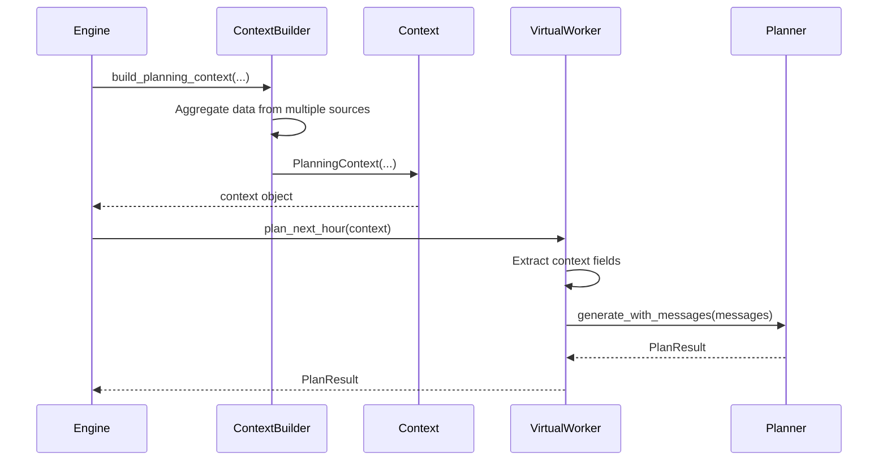

# VirtualWorker Context Classes Documentation

## Overview

The VirtualWorker Context Classes module (`src/virtualoffice/virtualWorkers/context_classes.py`) provides structured dataclasses that encapsulate all information needed for different types of worker operations. These context objects serve as clean, type-safe interfaces between the simulation engine and the VirtualWorker planning system.

## Module Location

```
src/virtualoffice/virtualWorkers/
├── __init__.py
├── context_classes.py          # Context dataclasses (NEW)
├── virtual_worker.py           # VirtualWorker implementation
├── planner_mixin.py            # Planning functionality
└── worker.py                   # Legacy worker utilities
```

## Purpose and Design Philosophy

### Separation of Concerns

The context classes separate **data aggregation** from **business logic**:

- **Engine/ContextBuilder**: Aggregates data from multiple sources (database, state, team roster)
- **Context Classes**: Encapsulate aggregated data in structured, immutable objects
- **VirtualWorker**: Consumes context objects to generate plans and reports

### Type Safety

All context classes use Python dataclasses with comprehensive type hints:
- Compile-time type checking with mypy
- IDE autocomplete and inline documentation
- Runtime validation of required fields
- Clear contracts between components

### Extensibility

Context classes can be extended without breaking existing code:
- New optional fields can be added with default values
- Existing fields maintain backward compatibility
- Subclassing supported for specialized contexts

## Core Context Classes

### PlanningContext

Context for hourly planning operations.

```python
@dataclass
class PlanningContext:
    """
    Context for hourly planning operations.
    
    Encapsulates all information a worker needs to generate
    an hourly plan, including project details, team roster,
    and recent communications.
    """
    project_plan: str
    daily_plan: str
    tick: int
    reason: str
    team: Sequence[PersonRead]
    recent_emails: list[dict[str, Any]] | None = None
    all_active_projects: list[dict[str, Any]] | None = None
    locale: str = "en"
    model_hint: str | None = None
```

#### Attributes

| Attribute | Type | Required | Description |
|-----------|------|----------|-------------|
| `project_plan` | `str` | Yes | Current project plan text |
| `daily_plan` | `str` | Yes | Today's daily plan text |
| `tick` | `int` | Yes | Current simulation tick |
| `reason` | `str` | Yes | Trigger reason (e.g., "start_of_hour", "new_message") |
| `team` | `Sequence[PersonRead]` | Yes | List of team members for communication context |
| `recent_emails` | `list[dict[str, Any]] \| None` | No | Optional list of recent emails for threading |
| `all_active_projects` | `list[dict[str, Any]] \| None` | No | Optional list of all active projects for multi-project scenarios |
| `locale` | `str` | No | Language/locale code (default: "en") |
| `model_hint` | `str \| None` | No | Optional model override for this planning operation |

#### Usage Example

```python
from virtualoffice.virtualWorkers.context_classes import PlanningContext
from virtualoffice.sim_manager.schemas import PersonRead

# Build context
context = PlanningContext(
    project_plan="Build dashboard MVP with authentication and data visualization",
    daily_plan="Focus on authentication module - implement login, session management",
    tick=10,
    reason="start_of_hour",
    team=[alice, bob, charlie],
    recent_emails=[
        {"id": 123, "subject": "Re: Auth design", "from": "bob@company.com"},
        {"id": 124, "subject": "Database schema", "from": "charlie@company.com"}
    ],
    all_active_projects=[
        {"id": 1, "name": "Dashboard MVP", "start_week": 1, "duration_weeks": 3},
        {"id": 2, "name": "Mobile App", "start_week": 2, "duration_weeks": 4}
    ],
    locale="en",
    model_hint="gpt-4o"
)

# Use in VirtualWorker
result = worker.plan_next_hour(context)
```

#### Multi-Project Support

When `all_active_projects` is provided:
- Worker can coordinate across multiple projects
- Planning considers workload distribution
- Communications reference appropriate project context
- Time allocation balanced across projects

#### Trigger Reasons

Common `reason` values:
- `"start_of_hour"` - Beginning of new hour
- `"new_message"` - Received email or chat message
- `"event_occurred"` - Simulation event triggered
- `"status_change"` - Worker status changed
- `"manual_replan"` - Manual replanning requested

### DailyPlanningContext

Context for daily planning operations.

```python
@dataclass
class DailyPlanningContext:
    """
    Context for daily planning operations.
    
    Encapsulates information needed to generate a daily plan,
    including project timeline and team composition.
    """
    project_plan: str
    day_index: int
    duration_weeks: int
    team: Sequence[PersonRead]
    locale: str = "en"
    model_hint: str | None = None
```

#### Attributes

| Attribute | Type | Required | Description |
|-----------|------|----------|-------------|
| `project_plan` | `str` | Yes | Current project plan text |
| `day_index` | `int` | Yes | Day number (0-indexed) |
| `duration_weeks` | `int` | Yes | Total project duration in weeks |
| `team` | `Sequence[PersonRead]` | Yes | List of team members |
| `locale` | `str` | No | Language/locale code (default: "en") |
| `model_hint` | `str \| None` | No | Optional model override for this planning operation |

#### Usage Example

```python
from virtualoffice.virtualWorkers.context_classes import DailyPlanningContext

# Build context for day 3 of a 3-week project
context = DailyPlanningContext(
    project_plan="Build dashboard MVP with authentication and data visualization",
    day_index=3,
    duration_weeks=3,
    team=[alice, bob, charlie],
    locale="ko",
    model_hint="gpt-4o"
)

# Use in VirtualWorker
result = worker.plan_daily(context)
```

#### Day Index Calculation

- **Day 0**: First day of simulation
- **Day 1**: Second day of simulation
- **Day N**: (N+1)th day of simulation
- **Week Calculation**: `week = (day_index // 5) + 1`

### EventContext

Context for event reaction operations.

```python
@dataclass
class EventContext:
    """
    Context for event reaction operations.
    
    Encapsulates information about a simulation event that
    a worker needs to react to appropriately.
    """
    event: dict[str, Any]
    tick: int
    team: Sequence[PersonRead]
    project_plan: dict[str, Any]
    locale: str = "en"
    model_hint: str | None = None
```

#### Attributes

| Attribute | Type | Required | Description |
|-----------|------|----------|-------------|
| `event` | `dict[str, Any]` | Yes | Event data dictionary with type, description, and payload |
| `tick` | `int` | Yes | Current simulation tick when event occurred |
| `team` | `Sequence[PersonRead]` | Yes | List of team members for coordination |
| `project_plan` | `dict[str, Any]` | Yes | Current project plan data |
| `locale` | `str` | No | Language/locale code (default: "en") |
| `model_hint` | `str \| None` | No | Optional model override for this reaction |

#### Usage Example

```python
from virtualoffice.virtualWorkers.context_classes import EventContext

# Build context for sick leave event
event_data = {
    "type": "sick_leave",
    "description": "Bob is out sick today",
    "target_id": 2,
    "payload": {
        "duration_days": 1,
        "severity": "moderate"
    }
}

context = EventContext(
    event=event_data,
    tick=50,
    team=[alice, bob, charlie],
    project_plan={
        "id": 1,
        "name": "Dashboard MVP",
        "plan": "Build authentication and data visualization..."
    },
    locale="en"
)

# Use in VirtualWorker
response = worker.react_to_event(context)
```

#### Event Types

Common event types:
- `"sick_leave"` - Team member absence
- `"client_request"` - New feature request
- `"blocker"` - Dependency or technical issue
- `"meeting"` - Scheduled gathering
- `"milestone"` - Project milestone reached
- `"deadline"` - Approaching deadline

#### Event Payload Structure

Event payloads vary by type but typically include:
- **Sick Leave**: `duration_days`, `severity`, `return_date`
- **Client Request**: `feature_description`, `priority`, `estimated_effort`
- **Blocker**: `blocker_type`, `affected_tasks`, `resolution_steps`
- **Meeting**: `meeting_type`, `duration_minutes`, `participants`

### ReportContext

Context for daily report generation.

```python
@dataclass
class ReportContext:
    """
    Context for daily report generation.
    
    Encapsulates information needed to generate an end-of-day
    report summarizing the worker's activities and progress.
    """
    day_index: int
    daily_plan: str
    hourly_log: str
    minute_schedule: str
    locale: str = "en"
    model_hint: str | None = None
```

#### Attributes

| Attribute | Type | Required | Description |
|-----------|------|----------|-------------|
| `day_index` | `int` | Yes | Day number (0-indexed) |
| `daily_plan` | `str` | Yes | Today's daily plan text |
| `hourly_log` | `str` | Yes | Log of hourly activities throughout the day |
| `minute_schedule` | `str` | Yes | Detailed minute-by-minute schedule |
| `locale` | `str` | No | Language/locale code (default: "en") |
| `model_hint` | `str \| None` | No | Optional model override for this report |

#### Usage Example

```python
from virtualoffice.virtualWorkers.context_classes import ReportContext

# Build context for end-of-day report
context = ReportContext(
    day_index=3,
    daily_plan="Focus on authentication module - implement login, session management",
    hourly_log="""
    09:00-10:00: Implemented login form validation
    10:00-11:00: Created session management service
    11:00-12:00: Wrote unit tests for authentication
    ...
    """,
    minute_schedule="""
    09:00-09:15: Review authentication requirements
    09:15-09:45: Implement form validation logic
    09:45-10:00: Test validation with edge cases
    ...
    """,
    locale="en",
    model_hint="gpt-4o"
)

# Use in VirtualWorker
report = worker.generate_daily_report(context)
```

#### Report Sections

Daily reports typically include:
- **Summary**: High-level overview of day's work
- **Completed Tasks**: What was finished
- **In Progress**: What's ongoing
- **Blockers**: Issues encountered
- **Next Steps**: Plans for tomorrow
- **Communications**: Key messages sent/received

### EventResponse

Structured response to a simulation event.

```python
@dataclass
class EventResponse:
    """
    Structured response to a simulation event.
    
    Represents how a worker reacts to an event, including
    plan adjustments, immediate actions, and communications.
    """
    adjustments: list[str] = field(default_factory=list)
    immediate_actions: list[dict[str, Any]] = field(default_factory=list)
    status_change: str | None = None
    communications: list[dict[str, Any]] | None = None
```

#### Attributes

| Attribute | Type | Required | Description |
|-----------|------|----------|-------------|
| `adjustments` | `list[str]` | No | List of textual adjustments to current plans |
| `immediate_actions` | `list[dict[str, Any]]` | No | List of immediate action dictionaries |
| `status_change` | `str \| None` | No | Optional status change (e.g., "sick_leave", "away") |
| `communications` | `list[dict[str, Any]] \| None` | No | Optional list of communication dictionaries to send |

#### Usage Example

```python
from virtualoffice.virtualWorkers.context_classes import EventResponse

# Worker reacts to client feature request
response = EventResponse(
    adjustments=[
        "Add new feature: User profile customization",
        "Increase sprint scope by 2 story points",
        "Defer low-priority bug fixes to next sprint"
    ],
    immediate_actions=[
        {
            "type": "create_task",
            "task_name": "Design user profile UI",
            "estimated_hours": 4
        },
        {
            "type": "update_timeline",
            "project_id": 1,
            "new_deadline": "2025-11-15"
        }
    ],
    status_change=None,
    communications=[
        {
            "channel": "email",
            "to": "manager@company.com",
            "subject": "New Feature Request - Profile Customization",
            "body": "I've reviewed the client's request and added it to our sprint..."
        },
        {
            "channel": "chat",
            "to": "team",
            "message": "Heads up: we have a new feature request that will affect our timeline"
        }
    ]
)

# Engine processes response
engine.apply_event_response(worker, response)
```

#### Adjustment Types

Common adjustment patterns:
- **Scope Changes**: "Add feature X", "Remove task Y"
- **Timeline Changes**: "Extend deadline by 2 days", "Accelerate milestone"
- **Priority Changes**: "Increase priority of task X", "Defer task Y"
- **Resource Changes**: "Request additional developer", "Reduce scope due to absence"

#### Immediate Action Types

Common action types:
- `"create_task"` - Add new task to project
- `"update_timeline"` - Modify project schedule
- `"reassign_task"` - Change task ownership
- `"escalate_issue"` - Escalate blocker to management
- `"request_resource"` - Request additional resources

#### Status Changes

Valid status change values:
- `"sick_leave"` - Worker is sick
- `"vacation"` - Worker on vacation
- `"away"` - Worker temporarily away
- `"overtime"` - Worker working extended hours
- `"working"` - Return to normal working status

## Integration with VirtualWorker

### Context Building Flow



### VirtualWorker Methods

The VirtualWorker class consumes context objects:

```python
class VirtualWorker:
    def plan_next_hour(self, context: PlanningContext) -> PlanResult:
        """Generate hourly plan using planning context."""
        # Extract context fields
        # Build prompt using PromptManager
        # Call planner
        # Return result
        
    def plan_daily(self, context: DailyPlanningContext) -> PlanResult:
        """Generate daily plan using daily planning context."""
        
    def react_to_event(self, context: EventContext) -> EventResponse:
        """React to simulation event using event context."""
        
    def generate_daily_report(self, context: ReportContext) -> str:
        """Generate daily report using report context."""
```

### ContextBuilder Integration

The `ContextBuilder` class (from `prompt_system` module) creates context objects:

```python
from virtualoffice.sim_manager.prompts.context_builder import ContextBuilder
from virtualoffice.virtualWorkers.context_classes import PlanningContext

builder = ContextBuilder(locale="en")

# Build planning context
context = builder.build_planning_context(
    worker=alice,
    tick=10,
    reason="start_of_hour",
    project_plan="Build dashboard MVP...",
    daily_plan="Focus on authentication...",
    team=[alice, bob, charlie],
    recent_emails=[...],
    all_active_projects=[...]
)

# Context is a PlanningContext dataclass
assert isinstance(context, PlanningContext)
```

## Localization Support

All context classes include a `locale` field for multi-language support:

### English Locale (Default)

```python
context = PlanningContext(
    project_plan="Build dashboard MVP",
    daily_plan="Focus on authentication",
    tick=10,
    reason="start_of_hour",
    team=[alice, bob],
    locale="en"  # English
)
```

### Korean Locale

```python
context = PlanningContext(
    project_plan="대시보드 MVP 구축",
    daily_plan="인증 모듈에 집중",
    tick=10,
    reason="start_of_hour",
    team=[alice, bob],
    locale="ko"  # Korean
)
```

### Locale-Aware Processing

The VirtualWorker uses the locale field to:
- Select appropriate prompt templates
- Format dates and times correctly
- Use locale-specific terminology
- Generate culturally appropriate communications

## Model Hints

All context classes support optional `model_hint` for LLM model selection:

### Default Model

```python
context = PlanningContext(
    ...,
    model_hint=None  # Use default model from configuration
)
```

### Override Model

```python
context = PlanningContext(
    ...,
    model_hint="gpt-4o"  # Use specific model for this operation
)
```

### Use Cases for Model Hints

- **Cost Optimization**: Use cheaper models for simple tasks
- **Quality Requirements**: Use advanced models for complex planning
- **A/B Testing**: Compare different models' performance
- **Fallback Strategy**: Try expensive model first, fall back to cheaper

## Testing

### Unit Tests

Location: `tests/test_virtual_worker_enhanced.py`

**Test Coverage**:
- Context object creation and validation
- Required field enforcement
- Optional field defaults
- Type checking and validation
- Serialization and deserialization

**Example Test**:
```python
def test_planning_context_creation():
    context = PlanningContext(
        project_plan="Build dashboard",
        daily_plan="Focus on auth",
        tick=10,
        reason="start_of_hour",
        team=[alice, bob]
    )
    
    assert context.project_plan == "Build dashboard"
    assert context.tick == 10
    assert context.locale == "en"  # Default
    assert context.model_hint is None  # Default
```

### Integration Tests

Location: `tests/test_sim_manager.py`

**Test Scenarios**:
- End-to-end planning with context objects
- Multi-project context handling
- Event reaction with context
- Report generation with context
- Localization with different locales

## Best Practices

### Context Creation

**DO**:
- Use ContextBuilder to create contexts
- Provide all required fields
- Use type hints for IDE support
- Validate data before creating context

**DON'T**:
- Create contexts manually in engine code
- Mix data aggregation with business logic
- Mutate context objects after creation
- Pass raw dictionaries instead of contexts

### Field Naming

**DO**:
- Use descriptive, unambiguous names
- Follow Python naming conventions (snake_case)
- Use consistent terminology across contexts
- Document field purpose in docstrings

**DON'T**:
- Use abbreviations or acronyms
- Use generic names like "data" or "info"
- Mix naming conventions
- Omit type hints

### Optional Fields

**DO**:
- Provide sensible defaults
- Document when fields are optional
- Use `None` for truly optional data
- Use `field(default_factory=list)` for mutable defaults

**DON'T**:
- Make everything optional
- Use mutable default values directly
- Assume optional fields are always present
- Forget to handle `None` values

## Future Enhancements

### Planned Features

1. **Validation Methods**: Add `validate()` methods to each context class
2. **Serialization**: Add `to_dict()` and `from_dict()` methods
3. **Context Chaining**: Support for derived contexts
4. **Context Caching**: Cache frequently used contexts
5. **Context Versioning**: Support for context schema evolution

### Extension Points

1. **Custom Context Classes**: Subclass for specialized scenarios
2. **Context Middleware**: Pre/post-processing hooks
3. **Context Transformers**: Convert between context types
4. **Context Validators**: Custom validation rules

## Related Documentation

- **VirtualWorker Module**: `docs/modules/virtual_worker.md` - VirtualWorker implementation
- **Prompt System**: `docs/modules/prompt_system.md` - PromptManager and ContextBuilder
- **Planner Module**: `docs/modules/planner.md` - Planner protocol and implementations
- **Architecture**: `docs/architecture.md` - Overall system architecture
- **Phase 4 Report**: `agent_reports/20251028_PHASE4_VIRTUALWORKER_ENHANCEMENT.md` - Implementation details

## Conclusion

The VirtualWorker Context Classes provide a clean, type-safe interface for passing data between the simulation engine and the VirtualWorker planning system. By encapsulating all necessary information in structured dataclasses, the system achieves:

- **Clear Contracts**: Explicit interfaces between components
- **Type Safety**: Compile-time and runtime type checking
- **Maintainability**: Easy to understand and modify
- **Extensibility**: Simple to add new fields or context types
- **Testability**: Easy to create test contexts

These context classes are a foundational component of the Phase 4 VirtualWorker enhancement, enabling worker-driven planning with comprehensive context awareness.
